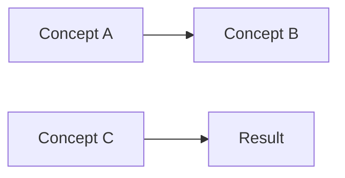

# Next.js Personal Site Maintenance

## Dev Setup & Config

### Debloating / Performance

**Telemetry** — Next.js sends anonymous telemetry on every run. Disable with env var (more reliable than `npx next telemetry disable`):

```bash
NEXT_TELEMETRY_DISABLED=1 next dev
```

Add to `dev`, `build`, and `start` scripts in `package.json` via `cross-env`:
```
"dev": "cross-env INIT_CWD=$PWD NEXT_TELEMETRY_DISABLED=1 next dev --webpack",
```

**Dev indicator** — Next.js renders a small badge/overlay in the corner during dev. Disable in `next.config.js`:
```js
devIndicators: false,
```

**Powered-By header** — Strips `X-Powered-By: Next.js` from all responses (minor privacy win). In `next.config.js`:
```js
poweredByHeader: false,
```

**Memory optimization** — The dev server and build process can consume 1-2GB+ in WSL. To reduce memory pressure:

- **Use Turbopack over webpack.** Turbopack compiles ~2× faster and uses significantly less heap (40-50% less memory in dev). Remove `--webpack` from scripts and any dead webpack-only loaders (e.g., `@svgr/webpack` if no `.svg` component imports exist). See the Turbopack migration section below for the full checklist.
- **Purge stale `.next/` cache.** The `.next/` directory accumulates build artifacts (often 800MB+). `rm -rf .next` before a build reclaims disk and reduces cache traversal overhead.
- **Clear `.contentlayer/generated/`** when changing many vault notes or switching branches. The generated JSON blobs can exceed 100MB and Contentlayer re-reads them on every build.
- **WSL memory cap.** If WSL crashes (OOM kill), check `.wslconfig` — the root cause was `memory=2GB` + `swap=0` (hard cap, no overflow). Working config (Aug 2026): `memory=4GB`, `processors=2`, `swap=4GB`, with `[experimental] autoMemoryReclaim=gradual` (was already set — the cap was the only blocker). `memory=` is a ceiling, not a reservation — idle WSL sits ~1GB regardless of cap.

**Verifying memory improvement:** After making changes, measure impact with `free -h` before and after the build:
```bash
# Before build
free -h && echo "---" && cat /proc/meminfo | head -5
npm run build
# After build
free -h && echo "---" && cat /proc/meminfo | head -5
```
A healthy build on a 4GB WSL with 65 vault notes and 110 pages should consume ~300-400MB temporarily and settle with 2.5-3GB available. No OOM kills, no swap thrashing. The `Available` field in `free -h` is the best indicator — it's what the kernel can actually allocate. If it drops below ~500MB during the build, memory pressure is still too high.

**Build timing sanity check:** After switching from webpack to Turbopack, the "Compiled successfully" step should drop from ~13s to ~6-7s on this project. If still slow, check whether `--webpack` is lingering in a script or plugin config.

These produce zero user-facing changes, just less overhead and fewer network requests.

### Next.js 16 Turbopack Compatibility

Next.js 16 enables Turbopack by default (faster, less memory than webpack). Running `next dev` or `next build` without `--webpack` uses Turbopack.

#### If the project has a custom webpack config

A custom `webpack` key in `next.config.js` (even one added by a plugin like `withContentlayer`) triggers a build error under Turbopack unless acknowledged:

```text
⨯ ERROR: This build is using Turbopack, with a `webpack` config and no `turbopack` config.
```

**Fix:** Add an empty `turbopack: {}` to `next.config.js`:

```js
turbopack: {},
```

This acknowledges the plugin-injected webpack config exists. The `withContentlayer` plugin injects its own webpack rules — it works fine under Turbopack with `turbopack: {}`.

#### ⚠️ CRITICAL: Contentlayer auto-generation broken under Turbopack

`withContentlayer` injects its own webpack plugin to auto-generate `.contentlayer/generated/` during `next build`. Under Turbopack, these webpack plugin hooks **never fire** — Contentlayer doesn't auto-generate the data layer.

**Symptom:** Build passes locally (because `.contentlayer/` is cached from a previous run) but fails on CI with:
```
Module not found: Can't resolve 'contentlayer/generated'
```
The build runs successfully when `.contentlayer/` already exists, but fails on a clean checkout.

**Fix:** Add `contentlayer2 build` as an explicit step before `next build` in the `package.json` build script:

```json
"build": "cross-env INIT_CWD=$PWD NEXT_TELEMETRY_DISABLED=1 contentlayer2 build && cross-env INIT_CWD=$PWD NEXT_TELEMETRY_DISABLED=1 next build && cross-env NODE_OPTIONS='--experimental-json-modules' node ./scripts/postbuild.mjs"
```

This ensures Contentlayer generates its output before Next.js compilation starts, regardless of bundler.

**Verification:** Test the fix by building from a clean state (matching CI):
```bash
rm -rf node_modules .contentlayer .next out
npm ci
npm run build
```

#### Full webpack → Turbopack migration (remove webpack entirely)

If the only custom webpack config is `@svgr/webpack` for SVG loading, and the project has no `.svg` files imported as React components, you can:

1. Remove the `webpack` key from `next.config.js`
2. Remove `@svgr/webpack` from `devDependencies`
3. Remove `--webpack` from `dev` and `build` scripts
4. Add `turbopack: {}` if `withContentlayer` or any other plugin injects webpack rules

**If SVG files ARE imported as React components** (`import Logo from '@/data/logo.svg'`), they'll break with `Element type is invalid` on `/_not-found` — see the SVG pitfalls section below for the fix.

**Auto-generated `next-env.d.ts` update:** When switching from webpack to Turbopack, Next.js auto-updates the import path in `next-env.d.ts` from `./.next/types/routes.d.ts` to `./.next/dev/types/routes.d.ts`. This is normal and should be committed — it reflects Turbopack's dev-mode build output path.

#### The `--webpack` fallback

If migration isn't viable, keep the existing pattern: `next dev --webpack` and `next build --webpack`. Turbopack can be re-enabled later.

### ⚠️ Inline SVG Dark Mode Fills

When an inline SVG has a colored background rect (logo badge, icon container), both the **rect fill** and **text/icon fill** need proper `dark:` variants. A common bug:

```tsx
// BAD — dark mode shows a light box with invisible text
<rect className="fill-gray-900 dark:fill-gray-100" />  // light rect in dark mode
<text fill="white">R</text>                              // white text invisible on light bg
```

```tsx
// GOOD — rect stays dark in both modes, text has proper dark variant
<rect className="fill-gray-900 dark:fill-gray-950" />  // nearly black, blends with bg
<text className="fill-white dark:fill-gray-100">R</text>  // visible in both modes
```

**Detection:** In dark mode, look for a visible colored box (often white or light gray) with invisible content. The `fill` attribute (not className) on SVG `<text>`, `<path>`, `<circle>` etc. is hardcoded and won't respond to `dark:` — always use Tailwind `fill-*` classes via `className` on SVG elements to get theme-aware colors.

**If the SVG is imported** from a file (e.g. `import Logo from '@/data/logo.svg'`), you can't control fills from the component. Convert to an inline component first, then add dark mode variants (see the SVG imports section below).

### Div badge fallback (when SVG text fill classes don't apply reliably)

Tailwind's `fill-*` classes on SVG `<text>` elements can be unreliable — the build compiles fine but the browser doesn't reflect the dark mode variant. If you've set proper `className="fill-white dark:fill-gray-100"` on SVG `<text>` and it still shows a white/light box in dark mode, replace the SVG with a plain div badge:

```tsx
// SVG approach (may fail in dark mode):
<svg className="h-8 w-8">
  <rect className="fill-gray-900 dark:fill-gray-950" />
  <text className="fill-white dark:fill-gray-100">R</text>
</svg>

// Div badge — uses bg/text which are battle-tested with Tailwind dark mode:
<div className="flex h-8 w-8 items-center justify-center rounded-lg bg-gray-900 text-white dark:bg-primary-500 dark:text-black">
  <span className="text-sm font-bold leading-none">R</span>
</div>
```

**When to use:** simple monogram/letter logos where the visual is just a colored badge with text. Avoids SVG `<text>` rendering quirks entirely.

**Using theme colors in dark mode:** For a site with a distinct brand color, pass it as the dark mode background — e.g. `dark:bg-primary-500 dark:text-black` gives a brand-colored badge in dark mode instead of an invisible or light box.

**Vertical alignment with header text:** When the logo badge (e.g. `h-8 w-8`) doesn't vertically-align with the header title text (e.g. `h-6 text-2xl`), remove the explicit height from the title div and let `text-2xl` size naturally. `flex items-center` on the parent then centers both elements by their natural heights, aligning their bottom edges.

## JSX / React Pitfalls

### HTML Entities in JSX String Literals
`&rarr;` (and other HTML entities) inside JSX **string literals** (`'...'` or `"..."`) render as **literal text** — the HTML entity is NOT parsed. This happens because JSX string expressions use JavaScript string semantics, not HTML parsing.

**Fix:** Use the actual Unicode character:
```tsx
// BAD — renders as literal "&rarr;"
<Link>{'View project &rarr;'}</Link>

// GOOD — renders as →
<Link>{'View project →'}</Link>
```

This applies anywhere you interpolate a string containing HTML entities inside `{...}` JSX expressions. HTML entities inside JSX element children (not in string literals) ARE parsed correctly — only guard against string literals.

### Inline SVG as React Components
The project previously used hand-written inline SVG components (e.g. Sun/Moon icons in `ThemeSwitch.tsx`). These have been migrated to lucide-react. Avoid adding new inline SVGs — use the icon library instead.

### ⚠️ SVG Imports as React Components (`import Logo from '@/data/logo.svg'`)

**The pattern:** `import Logo from '@/data/logo.svg'` (used in `Header.tsx` to render a small brand icon).

**Why it breaks:** This only works with `@svgr/webpack` configured in `next.config.js`. Without it, the import resolves to a URL string (Next.js's default asset handling), not a React component. When used as `<Logo />`, React throws:

```text
Error: Element type is invalid: expected a string (for built-in components)
or a class/function (for composite components) but got: object.
```

**The error manifests on `/_not-found`** because the SVG import is part of the root layout (`Header`), and Next.js prerenders the 404 page first.

**Fix:** Convert the SVG to an inline React component and remove the import:

```tsx
// Before:
import Logo from '@/data/logo.svg'
// After:
const Logo = () => (
  <svg xmlns="http://www.w3.org/2000/svg" viewBox="0 0 32 32" fill="none" className="h-8 w-8">
    <rect width="32" height="32" rx="8" fill="currentColor" />
    <text x="16" y="22" textAnchor="middle" fontSize="18" fontWeight="bold" fill="white" fontFamily="system-ui">
      R
    </text>
  </svg>
)
```

**Detection:** Search for `import.*\\.svg` patterns in the codebase. If any exist and `@svgr/webpack` is gone, they'll break at prerender time.

## Icon Library: lucide-react
[lucide-react](https://lucide.dev) is installed and is the standard icon library. Tree-shakeable (only imported icons bundled), TypeScript-native, ~1,800 icons.

### Installing
```bash
npm install lucide-react
```

### Usage Patterns

**Arrow in a link (inline with text):**
```tsx
import { ArrowRight } from 'lucide-react'

// Inside a <Link> or <a>:
<Link href={href}>
  <span className="inline-flex items-center gap-1">
    View Project
    <ArrowRight size={14} className="inline-block" />
  </span>
</Link>
```

**Theme switch icons:**
```tsx
import { Sun, Moon } from 'lucide-react'
// Use with size prop matching the old h-6 w-6 (24px)
{resolvedTheme === 'dark' ? <Sun size={20} /> : <Moon size={20} />}
```

### Migration from Text Arrows
When replacing literal `→` characters with ArrowRight:
1. The arrow text is usually inside a `<Link>` — the replacement renders as `<span className=\"inline-flex items-center gap-1\">Text <ArrowRight /></span>` to keep them on the same baseline.
2. Search all occurrences of `→` and `&rarr;` across the project before declaring done.
3. Import `ArrowRight` at the top of each file — don't re-export through a barrel, let tree-shaking work.

### Migration from Inline SVGs
When replacing hand-written SVG components with lucide-react:
1. Remove the entire SVG component definition (usually a `const Foo = () => (...)` block).
2. Import the equivalent lucide-react component: `import { Sun, Moon } from 'lucide-react'`.
3. Use the `size` prop to control dimensions. Old `className="h-6 w-6"` → `size={24}`, `className="h-5 w-5"` → `size={20}`.
4. The icons use `currentColor` by default — Tailwind text color classes work directly.

## Theme System
Dark mode toggle uses `next-themes` with lucide-react icons in `components/ThemeSwitch.tsx`. The old inline SVGs have been removed.

### Smooth Theme Transition (CSS)
To make the entire page's background/text color change smoothly when toggling dark/light mode, add a CSS transition on the `html` element:

```css
@layer base {
  html {
    transition: background-color 0.5s ease, color 0.5s ease;
  }
}
```

**Why this works:** `next-themes` toggles a `.dark` class on the `<html>` element. Tailwind's dark variants resolve to CSS custom properties (via `@theme`). Adding a transition on `background-color` and `color` on `html` makes all descendant elements inherit the transition via their Tailwind classes that reference these props. No JS needed.

**Tuning:** `0.5s` is a noticeable but not sluggish duration. `0.3s` feels snappy, `0.7s` feels dramatic. The `ease` timing function is a good default — avoid `linear` for color transitions as it looks mechanical.

**Gotcha:** Do NOT add a global `* { transition: ... }` — it will cause unwanted transitions on hover states, focus rings, and other transient interactions. Target only `html` for color/bg, and let Tailwind's utility classes handle per-element transitions.

## Animation with motion

[motion](https://motion.dev) (the v12+ rename of framer-motion) is installed and is the standard animation library. ~15KB gzip, tree-shakable, with built-in scroll-triggered reveals (`whileInView`), spring transitions, and hover effects.

### Installing
```bash
npm install motion
```

Import from `'motion/react'` — not `'framer-motion'`:
```tsx
import { motion } from 'motion/react'
```

### Theme Toggle Animation Pattern (Sun/Moon switch)
The icon swap on theme toggle is animated with a `key`-based remount trigger:

```tsx
<motion.div
  key={resolvedTheme}
  initial={{ rotate: -90, opacity: 0, scale: 0.5 }}
  animate={{ rotate: 0, opacity: 1, scale: 1 }}
  transition={{ type: 'spring', stiffness: 200, damping: 15 }}
>
  {resolvedTheme === 'dark' ? <Sun size={20} /> : <Moon size={20} />}
</motion.div>
```

**Key mechanism:** The `key={resolvedTheme}` prop causes React to treat the element as a new component instance on every theme toggle, replaying the `initial` → `animate` transition. Without `key`, the element reuses the same instance and won't re-animate.

**Transition tuning for spring:** `stiffness` controls speed (higher = faster), `damping` controls bounciness (lower = more bounce). Start with stiffness 200, damping 15 and adjust.

### Scroll-Triggered Reveals (Reusable wrapper pattern)
For elements that should animate in when scrolled into view:

```tsx
'use client'
import { motion } from 'motion/react'

export function Reveal({ children, delay = 0, className }) {
  return (
    <motion.div
      initial={{ opacity: 0, y: 20 }}
      whileInView={{ opacity: 1, y: 0 }}
      viewport={{ once: true, margin: '-50px' }}
      transition={{ duration: 0.5, delay }}
      className={className}
    >
      {children}
    </motion.div>
  )
}
```

**Gotchas:**
- Components using `motion` must be Client Components (`'use client'`) or used inside one.
- `viewport={{ once: true }}` ensures animation only plays once, not on every scroll re-entry.
- The `key` remount trick works for any element swap where you want re-animation (tab content, loading states, etc).

## Site-Integrated Obsidian Vault

The site includes an internal Obsidian vault at `data/vault/` for raw, unfiltered notes. These are auto-published under `/notes/` via Contentlayer's `VaultNote` document type.

### Mermaid Diagram Rendering

The site supports Mermaid diagrams via `rehype-mermaid`. Write standard Mermaid syntax in any `.md` or `.mdx` file and it renders as inline SVG at build time.

**Setup:**
```bash
npm install rehype-mermaid playwright
npx playwright install chromium
```

**In `contentlayer.config.ts`:**
Add `import rehypeMermaid from 'rehype-mermaid'` at the top, then add `rehypeMermaid` to the `rehypePlugins` array.

**Supported Mermaid diagram types:**
- `graph` / `flowchart` — flow graphs and architecture diagrams
- `stateDiagram` — state machines
- `sequenceDiagram` — interaction flows
- `classDiagram` — class hierarchies
- `timeline` — chronological sequences
- `quadrantChart` — 2D positioning

**Usage in vault notes:**
````markdown

````

**Gotcha:** The Mermaid rendering requires Playwright (Chromium) at build time because it renders diagrams via a headless browser. Ensure `playwright install chromium` is in the CI build script or deploy setup. The build will fail if Chromium isn't installed.

### Contentlayer Configuration

In `contentlayer.config.ts`:

```ts
// VaultNote doc type
export const VaultNote = defineDocumentType(() => ({
  name: 'VaultNote',
  filePathPattern: 'vault/**/*.{md,mdx}',       // matches data/vault/*.md
  contentType: 'mdx',
  fields: { title, date, tags, lastmod, draft, summary },
  computedFields: {
    ...computedFields,
    // slug strips the 'vault/' prefix: 'vault/hello-vault' → 'hello-vault'
    slug: { resolve: (doc) => doc._raw.flattenedPath.replace(/^.+?(\/)/, '') },
    // path keeps the full path: 'vault/hello-vault'
    path: { resolve: (doc) => doc._raw.flattenedPath },
  },
}))
```

### Notes Routing: Folder Hierarchy via `[[...slug]]`

The notes section uses a single **optional catch-all route** at `app/notes/[[...slug]]/page.tsx` that handles three cases:

| URL | slug | Action |
|-----|------|--------|
| `/notes` | `[]` (empty) | Root directory: list top-level notes + folders |
| `/notes/jepa_notes` | `['jepa_notes']` | Intermediate folder: list contents of `jepa_notes/` |
| `/notes/jepa_notes/01-ssl-history` | `['jepa_notes','01-ssl-history']` | Leaf note: render the MDX |

**Key pattern:** The page auto-detects folders vs files using an `isDirectory()` check — looks for any note whose `slug` starts with the current path as a prefix. No manual folder configuration needed.

**The `path` vs `slug` distinction:**
- `path`: `doc._raw.flattenedPath` — e.g. `vault/jepa_notes/01-ssl-history`. Internal Contentlayer identifier, NOT for routing.
- `slug`: strips the `vault/` prefix — e.g. `jepa_notes/01-ssl-history`. This IS the correct routing value.
- Always use `slug` for links: `/notes/${note.slug}` — never use `/${note.path}`.

### Frontmatter Conventions

| Field    | Required | Notes                                                                 |
|----------|----------|-----------------------------------------------------------------------|
| `title`  | yes      | Displayed on the note page                                            |
| `date`   | yes      | ISO or YYYY-MM-DD. Obsidian default is `created` — must be renamed to `date` |
| `tags`   | no       | List of strings, rendered as badges                                   |
| `draft`  | no       | Boolean (`true`/`false`). NOT `status: draft` — that's a different field Contentlayer ignores |
| `summary`| no       | Shown as excerpt in the listing card                                  |
| `lastmod`| no       | Optional last-modified date. Obsidian default is `updated` — rename to `lastmod` to track |

### KaTeX / Math Rendering

The site uses `remarkMath` + `rehypeKatex` in the Contentlayer MDX pipeline to render LaTeX (`$...$`, `$$...$$`). However, the KaTeX **CSS** must be explicitly imported — the rehype plugin only generates the HTML structure.

### Per-Page CSS Import (Current Pattern)

The blog page (`app/blog/[...slug]/page.tsx`) imports KaTeX CSS:
```tsx
import 'katex/dist/katex.css'  // line 2, after prism.css
```

The notes page (`app/notes/[[...slug]]/page.tsx`) does NOT import it. The CSS must be added to every page that renders math content.

### Static Asset Approach (Alternative)

Because building the full site takes 600s+ (large MDX math files), an alternative is to serve KaTeX CSS as a static asset and load it via `<link>` in the root layout — no rebuild needed:

```bash
cp node_modules/katex/dist/katex.css public/css/katex.css
cp node_modules/katex/dist/fonts/* public/css/fonts/
```

Then in `app/layout.tsx`, add a `<link>` — but **React 19 requires `precedence="default"`** on `<link rel="stylesheet">` when rendered outside an explicit `<head>` tag:

```tsx
<link rel="stylesheet" href={`${basePath}/css/katex.css`} precedence="default" />
```

**Why:** Next.js layouts often omit `<head>` and place `<link>`/`<meta>` elements between `<html>` and `<body>`. Without `precedence`, React 19 throws: `Cannot render a <link rel="stylesheet" /> outside the main document without knowing its precedence.` The `precedence` prop tells React the stylesheet's priority for deduplication.

**Error message:** `Cannot render a <link rel="stylesheet" /> outside the main document without knowing its precedence. Consider adding precedence="default" or moving it into the root <head> tag.` — fix by adding `precedence="default"` to every `<link rel="stylesheet">` in layouts that lack an explicit `<head>`.

The KaTeX CSS references fonts relative to itself (`fonts/KaTeX_*.woff2`), so both CSS and fonts must be served from the same path.

**⚠️ CRITICAL PITFALL — Static assets must be tracked in git:** This project's `.gitignore` ignores `public/css/`. Files copied there (`public/css/katex.css`, `fonts/`) exist only on disk — they are NOT tracked in git. GitHub Actions (or any CI that runs `git clone`) never creates them, so the layout's `<link>` silently 404s on the deployed site. **The `import` approach is the only reliable method for this project.**

If you discover a "works locally, broken on deploy" issue with KaTeX rendering:
1. Verify with `git ls-files public/css/katex.css` — if it returns nothing, the file isn't tracked.
2. Fix by adding `import 'katex/dist/katex.css'` to the page that renders math (not by committing the static asset to a gitignored dir).

**Every page that renders KaTeX must have its own import.** Currently the blog page (`app/blog/[...slug]/page.tsx`) has it but the notes page (`app/notes/[[...slug]]/page.tsx`) does not — if you add a new route that renders vault notes or blog content, include the same import.

### Symptoms of Missing KaTeX CSS

Without `katex.css`, the `.katex-mathml` element (which normally has `clip-path: inset(50%); width: 1px; overflow: hidden;`) becomes visible. This causes **double rendering** — the raw LaTeX source (inside `<annotation>` in the MathML) appears as visible text alongside the unstyled KaTeX HTML.

### rehype-preset-minify Causes the Same Double-Rendering (Different Mechanism)

`rehype-preset-minify` minifies HTML output from all rehype plugins, including KaTeX. It strips `aria-hidden="true"` from `<span class="katex-html">` and other KaTeX-specific attributes. Without `aria-hidden="true"`, screen-reader-targeted elements (`.katex-mathml`) become visually displayed alongside the rendered math — even if `katex.css` is properly loaded.

**Same symptom, different root cause.** The `katex.css` case shows unstyled HTML; the `rehype-preset-minify` case shows fully styled math + raw source. Either way, the fix is to **remove `rehype-preset-minify` entirely** from `contentlayer.config.ts` — both the import and the entry in the `rehypePlugins` array. It's a fragile plugin that breaks specialized HTML output (KaTeX, Mermaid SVGs) and its byte savings are negligible.

### Build Performance with Math-Heavy Content

The `rehypeKatex` + `rehypeMermaid` pipeline on large math documents (3000+ lines, ~500 equations) causes the Next.js build to take **600+ seconds**. This is a known performance issue — the full build (`npm run build`) may timeout in CI if the default action runner limit is lower. The GitHub Actions runner has a 360-minute limit so it should complete, but local builds will be slow.

### KaTeX Version

Check installed version:
```bash
npm ls katex
```

The KaTeX CSS must match the `rehype-katex` version used by Contentlayer. The HTML structure changes between KaTeX versions — mismatched CSS can cause broken rendering.

See `references/katex-css-troubleshooting.md` for full debugging steps and reproduction of the double-render issue.

## Contentlayer Warning: Undefined Fields

Contentlayer reports a warning (not error) for fields in frontmatter that aren't defined in the document type schema:

```
Warning: Found 1 problems in 6 documents.
 └── "vault/jepa_notes/02-ssl-theory.md" of type "VaultNote" has the following extra fields:
     • aliases: ["SSL Theory","Collapse Mathematics","Predictive SSL Theory"]
```

This warning is **harmless** — the document is still processed and included. Extra fields are silently ignored. Only **missing required fields** cause Contentlayer to skip a document entirely (see the debugging checklist).

### Debugging Missing Vault Notes

**Contentlayer silently drops documents missing required fields** without errors or warnings. This is the #1 cause of notes not showing up.

**Verification:** Check what Contentlayer actually generated:
```
ls .contentlayer/generated/VaultNote/
```
Each valid document produces a JSON file (e.g. `vault__hello-vault.md.json`). If your new note's JSON is absent, the frontmatter is wrong.

**Common Obsidian → Contentlayer field mismatches:**

| Obsidian convention | Contentlayer expects | Problem |
|---------------------|----------------------|---------|
| `created:` | `date:` (required!) | Missing `date` = silent file skip |
| `updated:` | `lastmod:` | Harmless if absent, but won't be tracked |
| `status: draft` | `draft: true` (boolean) | `status` is not a defined field; the string `"draft"` is truthy so `note.draft !== true` filters it out |
| `aliases:` | (none) | Ignored, harmless |

**Debugging checklist:**

1. Verify the file is inside `data/vault/` (the `filePathPattern` is `vault/**/*.{md,mdx}` — subdirectories like `jepa_notes/` work fine).
2. Check the file has BOTH `title` and `date` with the exact field names from `contentlayer.config.ts`.
3. `draft` must be a boolean (`true` or `false`), not a string — `draft: true` ✓, `status: draft` ✗.
4. Regenerate Contentlayer (restart dev server), then inspect `.contentlayer/generated/VaultNote/`.
5. If the JSON exists but the note doesn't appear, check `app/notes/[[...slug]]/page.tsx` — specifically `note.draft !== true` and `isDirectory()` detection.
6. If Obsidian created the file, remember its default templates use `created`/`updated`/`status` — these must be renamed for Contentlayer.
7. Run the standalone Contentlayer verification to confirm all documents are picked up:
   ```bash
   npx contentlayer2 build
   node -e "
   const { allVaultNotes } = require('./.contentlayer/generated/index.mjs');
   allVaultNotes.forEach(n => console.log(n.slug, '| draft:', n.draft, '| date:', n.date));
   "
   ```
   Every expected vault note should appear here. Missing entries mean a required field (usually `date`) is absent — Contentlayer skips those silently with no build error.

### MDX Pitfalls in Vault Notes

Vault notes have `contentType: 'mdx'` in contentlayer.config.ts — even `.md` files are processed by the MDX parser, not plain markdown. This means JSX syntax rules apply.

**The `<` character is JSX syntax:** Any bare `<` in body text that doesn't start a valid HTML/JSX tag causes a compile error. This commonly appears in:
- Math inequalities: `x < 5`, `ε < 1` → must be escaped as `x &lt; 5`, `ε &lt; 1`
- Generic comparisons/arrows in prose

**Fix:** Use the HTML entity `&lt;` for `less-than` anywhere it appears outside code blocks. The `>` character is less commonly an issue but `&gt;` is the corresponding entity.

**How to detect:** The dev server will hang silently during Contentlayer generation with no error output. Run a targeted MDX compile to diagnose:
```bash
cd /mnt/e/rajatkb.github.io
node --input-type=module -e "
import { compile } from '@mdx-js/mdx';
import { readFileSync } from 'fs';
import remarkGfm from 'remark-gfm';
import remarkMath from 'remark-math';
const content = readFileSync('path/to/your-note.md', 'utf-8');
try {
  await compile(content, { format: 'mdx', remarkPlugins: [remarkGfm, remarkMath] });
  console.log('MDX compile OK');
} catch(e) { console.log('Error:', e.message); }
"
```

This script isolates the MDX processing from Contentlayer's pipeline, revealing the exact error message and line.

**Curly braces: two failure modes, same cause**

`{` and `}` are JSX expression delimiters in MDX. The failure mode depends on whether the brace content is valid JavaScript:

- **Multi-word / invalid JS** (`{A on B}`, `{indoor setting}`) — fails at **build time** with acorn parse error:
  ```
  Cannot process MDX file with esbuild: Could not parse expression with acorn
  ```
- **Single-word / valid JS** (`{glass}`, `{indoor}`) — compiles successfully, but crashes at **prerender time** with:
  ```
  ReferenceError: glass is not defined
  ```
  Because MDX evaluates `{glass}` as the JS variable `glass`, which doesn't exist.

**Three escape strategies:**
1. **Backticks** (best for notation/symbols that look like code) — `A on B` renders as `{A on B}` verbatim.
2. **`{'{'}` / `{'}'}`** — JSX string interpolation that produces literal `{`/`}`.
3. **HTML entities** `&#123;`/`&#125;` — works but harder to read.

Prefer backticks when the curlies represent mathematical or programming notation (e.g. `{glass}` → `{transparent, fragile}`) rather than actual variable values.

### LaTeX Commands Outside Math Blocks (MDX Curly-Brace Variant)

LaTeX commands with `{...}` arguments that appear **outside** math delimiters (`$...$`) also cause `ReferenceError` at prerender time — same mechanism as bare `{word}`, different trigger.

**Mechanism:** In MDX, a backslash before an identifier escapes it (renders as literal text), but the `{...}` that follows is still parsed as a JSX expression. So `\texttt{LD2Z}` becomes text `texttt` + JS expression evaluating variable `LD2Z`:

```
✗ \texttt{LD2Z}      → text "texttt" + ReferenceError: LD2Z is not defined
✓ $\texttt{LD2Z}$    → remarkMath + rehypeKatex renders it as LaTeX typewriter text
✓ \texttt\{LD2Z\}    → escaped braces render as literal `\texttt{LD2Z}`
```

**Common LaTeX commands that trigger this (when outside `$...$`):**
- `\texttt{txt}` — typewriter text
- `\"{o}` or `\"{u}` etc. — umlaut diacritics (`\"` is the LaTeX umlaut command, `{o}` is parsed as JS expression)
- `\textit{txt}`, `\textbf{txt}`, `\textsc{txt}` — text formatting

**Fix options (prefer first):**
1. **Wrap in math delimiters** — `$\texttt{LD2Z}$` — if the intent is LaTeX rendering. remarkMath processes the `$...$` before the MDX compiler sees the braces.
2. **Replace with Unicode** — `\"{o}` → `ö`, `\"{u}` → `ü`. Cleanest for paper titles with accented characters.
3. **Escape the braces** — `\texttt\{LD2Z\}` — produces literal text if no math rendering is wanted.

**How to detect:** The error message at prerender time includes the undefined variable name (e.g. `ReferenceError: LD2Z is not defined` or `ReferenceError: o is not defined`). Search the failing file for `\command{var}` patterns where `\command` is a LaTeX command and `{var}` is the variable referenced in the error.

**Note:** LaTeX commands **inside** `$...$` are handled correctly by remarkMath → rehypeKatex and do NOT trigger this issue.

**Detection:** If the build compiles successfully but fails during prerendering with `ReferenceError: <word> is not defined`, search for bare `{word}` patterns in the file — they're being interpreted as JS variables.

**Git commit message pitfall:** When writing commit messages that reference `{...}` patterns (e.g., describing MDX curly brace fixes), wrap the message in single quotes (`'...'`) to prevent bash brace expansion. With double quotes, bash expands `{A on B}` into `A on B` (treating `{...}` as brace expansion syntax), producing a malformed commit message.

**HTML table syntax** (`| ... |`) works but can confuse the parser if malformed.

### ⚠️ Pre-publish: Wikilink & Relative Link Conversion

Obsidian wikilinks (`[[note-name]]`) and relative `.md` links (`[text](file.md)`) do NOT work through the Contentlayer/MDX pipeline:

| Syntax in vault note | What renders on site | Fix |
|---------------------|---------------------|-----|
| `[[02-ssl-theory]]` | Literal text `[[02-ssl-theory]]` | `[02-ssl-theory](/notes/jepa_notes/02-ssl-theory)` |
| `[→ next note](02-jepa-theory.md)` | Broken relative URL | `[→ next note](/notes/jepa_notes/02-ssl-theory)` |

**Every vault note commit must pass this checklist:**

- [ ] `grep -rn '\[\[.*\]\]' data/vault/` — convert any wikilinks to `/notes/...` absolute markdown links
- [ ] `grep -rn '\](' data/vault/ | grep -v 'https\?://' | grep -v '/notes/'` — catch broken relative `.md` links
- [ ] Verify filenames in relative links actually exist in `data/vault/`
- [ ] Run `npm run build` — catches any `<`/`{`/`}` MDX errors introduced by edits
- [ ] Curl the deployed page after push to confirm links resolve

Full conversion guide with examples: see the `vault-in-site-repo.md` reference in the knowledge-management skill.

### Obsidian Setup

If the repo lives in WSL and you run Obsidian on Windows, `\\\\wsl.localhost\\` may not be accessible for symlinks/junctions. Use `scripts/sync-vault.sh` instead:

```bash
bash scripts/sync-vault.sh          # one-time push: repo → Windows (for Obsidian)
npm run watch                       # start watcher as background process (detached, returns immediately)
npm run blind                       # kill the background watcher process
```

**Script direction is always Repo → Windows.** The script only pushes changes from the WSL repo to the Windows Obsidian vault. There is no pull-from-Windows functionality — files created/edited on the repo side (by Hermes, git pulls, or direct editing) are synced to Windows. Obsidian-side edits should be committed via git on the WSL side.

**`npm run watch`:** starts `sync-vault.sh --watch` in the **background** (via `&`) and saves the PID to `.vault-watch.pid`. Returns to the prompt immediately. The watcher uses `inotifywait` to monitor `data/vault/` (native WSL ext4 filesystem — inotify works reliably here) and runs `sync_push` on changes after a 1.5s debounce. This is the correct mode for long-running sessions where Hermes or git operations add files to `data/vault/`.

**`npm run blind`:** reads `.vault-watch.pid`, kills that process, and removes the PID file. If no watcher is running, prints `→ No vault watcher running` and exits cleanly.

**Keep scripts single-purpose:** `npm run dev` only starts the Next.js dev server. The vault watcher is a separate concern — start it with `npm run watch` in any terminal and kill it with `npm run blind` when done. The PID file lives at the project root and is gitignored.

**Dependencies:**
- `rsync` — `sudo apt-get install -y rsync`
- `inotify-tools` (for `--watch` mode) — `sudo apt-get install -y inotify-tools`

The script uses `--delete` mirroring, so it handles renames and deletions correctly. The `.obsidian/` folder is excluded from pushes (never pushed to Windows).

**Architecture:**
- `scripts/sync-vault.sh` — core sync script (one-shot push or watch-push modes, debounced `inotifywait` + `rsync`). Uses **git-diff pre-scan** (`git diff --diff-filter=ACMRT HEAD -- data/vault/` + `git ls-files --others`) to detect every new/modified/untracked file before rsync, then verifies each one arrived at the destination. This catches files rsync might miss due to WSL mount timestamp quirks.
- `package.json` `"watch"` → `bash scripts/sync-vault.sh --watch & ...`
- `package.json` `"blind"` → kills the background watcher
- `package.json` `"dev"` runs Next.js only (no watcher bundled)

See `references/vault-wsl-sync.md` for setup details.

### Git Management: .obsidian Folder

The `data/vault/.obsidian/` folder (workspace state, appearance settings, plugin config) **must never be tracked in git** — it's machine-local state that changes every time you open a vault note.

**Prevent future tracking:** add to `.gitignore`:
```
data/vault/.obsidian/
```

**Remove from existing tracking:**
```bash
git rm --cached -r data/vault/.obsidian/
```

**Purge from git history** (so `.obsidian` files don't leak into clones/forks):
```bash
FILTER_BRANCH_SQUELCH_WARNING=1 git filter-branch --force \
  --index-filter 'git rm --cached --ignore-unmatch -r data/vault/.obsidian/' \
  --prune-empty -- --all
# Then clean up backup refs and reclaim space:
git update-ref -d refs/original/refs/heads/main
git reflog expire --expire=now --all
git gc --prune=now --aggressive
```

**After force-push:** all collaborators must re-clone (a normal `git pull` on rewritten history will fail with divergent branches).

## Conditional Rendering by Route

When you need to show/hide UI elements based on the current route, use `usePathname()` from `next/navigation`:

```tsx
'use client'

import { usePathname } from 'next/navigation'

export default function MyComponent() {
  const pathname = usePathname()
  const showSomething = pathname !== '/about'

  return (
    <footer>
      {showSomething && <SomeElement />}
    </footer>
  )
}
```

**Gotchas:**
- The component **must** be a Client Component (`'use client'` directive) because `usePathname()` is a React hook only available in client components. If the component is used by a Server Component layout (e.g., Footer in `layout.tsx`), add `'use client'` at the top.
- Check `trailingSlash` in `next.config.js` — if `trailingSlash: true`, the actual pathname is `/about/` not `/about`. Always handle both variants: `pathname !== '/about' && pathname !== '/about/'`, or use `pathname.replace(/\/$/, '') !== '/about'` to strip the trailing slash before comparing.
- For dynamic routes, use `pathname.startsWith('/blog/')` — but beware trailing slashes again (e.g. `/blog/some-post/` still matches).
- This is preferred over Redux/Zustand for simple route-based conditions — keep state management for complex cross-cutting concerns.

## Card Layout (Portfolio / Project Cards)

The project grid uses a flex-wrap two-column layout with cards that push tags and CTAs to the bottom.

### Desired Structure
```
+---------------------+
| [image, optional]    |
| ------------------- |
| Year                 |
| Title                |
| Description          |
| -- spacer (flex-1) --|  <-- pushes tags + CTA down
| Tag  Tag  Tag        |
| Learn more ->        |
+---------------------+
```

### Implementation Pattern

The outer container in the page:
```tsx
<div className="-m-4 flex flex-wrap">
  {items.map(item => <Card key={item.title} ... />)}
</div>
```

Each card is `md:w-1/2` — two-column on medium+ screens, single column on mobile.

### Card Component Structure

```tsx
<div className="md max-w-[544px] p-4 md:w-1/2">
  <div className="h-full overflow-hidden rounded-md border-2 ...">
    {imgSrc && <Image ... />}
    <div className="flex flex-col p-6">
      <div className="flex-1">
        {/* Year, Title, Description */}
      </div>
      {tags?.length > 0 && (
        <div className="flex flex-wrap gap-1.5 py-3">
          {tags.map(tag => <Tag key={tag} text={tag} />)}
        </div>
      )}
      {href && (
        <Link ...>
          <span className="inline-flex items-center gap-1">
            Learn more
            <ArrowRight size={14} className="inline-block" />
          </span>
        </Link>
      )}
    </div>
  </div>
</div>
```

### Critical Pitfalls

1. **`h-full` on outer border div is required** — Always set `className="h-full ..."` on the card's border wrapper div. Without it, cards without images won't stretch to match the row height in the flex-wrap grid.

2. **Do NOT put `h-full` on the inner flex div** — The inner `<div className="flex flex-col p-6">` should NOT have `h-full`. If it does, cards without images will stretch taller than cards with images, breaking the consistent bottom alignment. The outer `h-full` on the border div + `flex-1` on the content spacer handle the sizing correctly.

3. **Tags go below description, not beside year** — Tags should sit between the description (wrapped in `flex-1`) and the CTA link, wrapped in a div with `py-3`. The year goes in its own line at the top.

4. **Consistent card heights** — The `h-full` on each card's border div ensures all cards in a flex-wrap row match height. Without `flex-1` on the content area, cards with less text leave gaps at the bottom.

## Search System

Search uses **pliny** + **kbar** (Cmd+K command palette). At build time, `contentlayer.config.ts` generates `public/search.json` via the `createSearchIndex()` function. KBar loads this JSON client-side and fuzzy-searches it in-memory. No backend, no API — fully static.

### Generation Mechanism

The entry point is in `contentlayer.config.ts`:

```ts
onSuccess: async (importData) => {
  const { allBlogs } = await importData()
  // CRITICAL: Include { slug: undefined } for the root /notes/ path — without it,
  // static export (output: 'export') won't generate /notes/index.html
  // and /notes/ returns 404 on GH Pages.
  return [rootParam, ...noteParams, ...folderParams]
}

Both note pages AND folder listing pages are statically generated at build time. The root `/notes` path requires `{ slug: undefined }` in `generateStaticParams` (not `{}`) — Next.js 16 static export rejects `{}` for `[[...slug]]` root params, causing "missing generateStaticParams()" at export time.
  writeFileSync(
    `public/${path.basename(siteMetadata.search.kbarConfig.searchDocumentsPath)}`,
    JSON.stringify(allCoreContent(sortPosts(allBlogs)))
  )
}
```

The function only receives `allBlogs` from contentlayer — it does NOT include projects, pages, or any non-MDX content.

### Adding Projects to Search

Projects are defined as a plain TypeScript array in `data/projectsData.ts`, not as MDX files. To include them in the search index:

1. Import projectsData into `contentlayer.config.ts`:
```ts
import projectsData from './data/projectsData'
```

2. Map projects into the same shape as CoreContent blog posts (needs: `title`, `summary`, `date`, `tags`, `path`, `type`, `slug`, `draft`, `layout`):
```ts
const projectEntries = projectsData.map((p) => ({
  title: p.title,
  summary: p.description,
  date: `${p.year}-01-01`,
  tags: p.tags,
  path: p.href,     // external URL for projects
  type: 'Project',
  slug: p.href,
  draft: false,
  layout: 'external',
}))
```

3. Merge with blog entries before writing:
```ts
function createSearchIndex(allBlogs) {
  const merged = [...allCoreContent(sortPosts(allBlogs)), ...projectEntries]
  writeFileSync(..., JSON.stringify(merged))
}
```

**Gotchas:**
- projectsData is CJS/TS, not an MDX contentlayer document — it doesn't have `readingTime`, `toc`, `filePath` or other computed fields that blog entries do. The `allCoreContent()` utility strips computed fields from blogs, so mapped projects just need to match the CoreContent shape.
- Projects with external links use `path: p.href` — KBar will navigate to that URL when selected. If the project is internal, use a relative path like `/projects#${p.title}`.
- After modifying `contentlayer.config.ts`, run a full build to regenerate `public/search.json`.

### Triggering Search

Press **Cmd+K** (Mac) or **Ctrl+K** (Windows/Linux) to open the command palette and start typing. Results include both blog posts and any other content added to search.json. The palette also includes default navigation actions configured by pliny.

### External Links in Search Results (Gotcha + Fix)

**The problem:** KBar's built-in `mapPosts` function does `router.push("/" + post.path)` on every search result, prepending a `/`. For projects where `path` is a full URL like `https://github.com/...`, navigation becomes `https://site.com/https://github.com/...` — a broken relative URL.

**The fix:** Provide a custom `onSearchDocumentsLoad` callback to KBar that handles external vs internal links differently. Pliny's `KBarSearchProvider` accepts this callback, but you need to bypass their `SearchProvider` wrapper to pass it.

#### Step 1: Create a custom SearchWrapper

```tsx
// components/SearchWrapper.tsx
'use client'

import { KBarSearchProvider } from 'pliny/search/KBar'
import { useRouter } from 'next/navigation'
import { formatDate } from 'pliny/utils/formatDate'

export default function SearchWrapper({ searchConfig, children }) {
  const router = useRouter()
  const { kbarConfig } = searchConfig

  return (
    <KBarSearchProvider
      kbarConfig={{
        ...kbarConfig,
        onSearchDocumentsLoad: (json: any[]) => {
          const actions = []
          for (const post of json) {
            actions.push({
              id: post.path,
              name: post.title,
              keywords: post.summary || '',
              section: 'Content',
              subtitle: formatDate(post.date, 'en-US'),
              perform: () => {
                // External project links open in new tab
                if (post.layout === 'project') {
                  window.open(post.path, '_blank', 'noopener,noreferrer')
                } else {
                  router.push('/' + post.path)
                }
              },
            })
          }
          return actions
        },
      }}
    >
      {children}
    </KBarSearchProvider>
  )
}
```

#### Step 2: Use SearchWrapper in layout instead of pliny's SearchProvider

```tsx
// app/layout.tsx
import SearchWrapper from '@/components/SearchWrapper'
import { SearchConfig } from 'pliny/search'

<SearchWrapper searchConfig={siteMetadata.search as SearchConfig}>
  <Header />
  <main>{children}</main>
</SearchWrapper>
```

#### Step 3: Mark project entries in the search index

In `contentlayer.config.ts`, set a sentinel `layout` field on project entries:

```ts
projectsData.map((p) => ({
  title: p.title,
  summary: p.description,
  date: `${p.year}-01-01`,
  tags: p.tags,
  draft: false,
  layout: 'project',    // <-- sentinel for external link handling
  slug: p.href,
  path: p.href,
}))
```

#### Important notes about this technique

- **`KBarSearchProvider` takes `kbarConfig` as a direct prop**, not wrapped in `searchConfig`. Pliny's `SearchProvider` is a thin wrapper that destructures `searchConfig.kbarConfig` and passes it — the direct component requires the already-destructured form.
- **TypeScript issues:** `KBarSearchProvider` types from pliny may be incomplete. The `json` parameter and actions array may need `any` types or a `// @ts-nocheck` at the top of the wrapper file.
- **The `key` on actions must be unique.** Using `post.path` works as long as paths are unique. If blog posts and projects could share a path, prefix project IDs (e.g. `'project-' + p.href`).

## Comments (Giscus Integration)

Comments use [Giscus](https://giscus.app) — a widget that stores comments as GitHub Discussions. No backend database needed.

### Setup

1. Enable GitHub Discussions on the repo (Settings → Features → Discussions)
2. Install the Giscus GitHub App at https://github.com/apps/giscus
3. Visit https://giscus.app, enter the repo, and copy the generated config values
4. Set these environment variables:
   - `NEXT_PUBLIC_GISCUS_REPO` — `owner/repo` (e.g. `rajatkb/rajatkb.github.io`)
   - `NEXT_PUBLIC_GISCUS_REPOSITORY_ID` — from giscus.app
   - `NEXT_PUBLIC_GISCUS_CATEGORY` — Discussion category name
   - `NEXT_PUBLIC_GISCUS_CATEGORY_ID` — from giscus.app

### Making Comments Optional (Hide When Unconfigured)

The `comments` config in `siteMetadata.js` should be conditional on env vars so the "Load comments" section doesn't appear when Giscus isn't set up:

```js
comments: process.env.NEXT_PUBLIC_GISCUS_REPO
  ? {
      provider: 'giscus',
      giscusConfig: {
        repo: process.env.NEXT_PUBLIC_GISCUS_REPO,
        repositoryId: process.env.NEXT_PUBLIC_GISCUS_REPOSITORY_ID,
        category: process.env.NEXT_PUBLIC_GISCUS_CATEGORY,
        categoryId: process.env.NEXT_PUBLIC_GISCUS_CATEGORY_ID,
        mapping: 'pathname',
        reactions: '1',
        metadata: '0',
        theme: 'light',
        darkTheme: 'transparent_dark',
        themeURL: '',
        lang: 'en',
      },
    }
  : null,  // <-- null hides the comments section entirely
```

**Gotcha:** Use `null` (not `{}`) for the fallback. The layout files check `siteMetadata.comments &&` — an empty object `{}` is truthy and would still render the comments placeholder. `null` is falsy and correctly skips it.

Set env vars in your deployment platform (Vercel, etc.) or `.env.local` for local dev. The build picks them up at build time since this config is evaluated at module load in a Node.js context.

## CI/CD: GitHub Actions Deploy (Static Export)

The site deploys to GitHub Pages via `.github/workflows/pages.yml` — a two-job workflow: **build** (Next.js static export → `out/`) then **deploy** (upload artifact → GitHub Pages).

### Workflow structure

```yaml
jobs:
  build:
    steps:
      - actions/checkout@v4
      - actions/setup-node@v4 with node-version: '22'  # was '20', deprecated Oct 2025
      - actions/configure-pages@v5
      - Restore .next/cache
      - npm ci
      - npm run build            # runs with EXPORT=1, UNOPTIMIZED=1, BASE_PATH=<auto>
      - actions/upload-pages-artifact@v5 (path: ./out)
  deploy:
    needs: build
    - actions/deploy-pages@v4
```

### Debugging "Build passes locally, fails on CI"

Build exit code 1 on CI while passing locally is the most common failure mode.

**Diagnostic workflow:**

1. Check CI run status at `https://github.com/<owner>/<repo>/actions` — click the failed run, then the failed "build" job. The annotation panel shows which step failed.
2. Identify the last successful run (same page, newest green checkmark). Diff the commits since then:
   ```bash
   git diff <last-successful-commit>..HEAD --stat
   ```
3. Reproduce the CI build locally from a **completely clean state**:
   ```bash
   rm -rf node_modules .contentlayer .next out
   npm ci
   EXPORT=1 UNOPTIMIZED=1 npm run build
   ```
   A build that passes with cached `node_modules`/`.contentlayer/` may fail from clean. This catches Contentlayer auto-generation issues, stale lockfiles, and missing build steps.

4. If the deployed site shows a GitHub 404 page, the custom workflow is failing and GitHub's built-in `pages-build-deployment` is deploying an empty Jekyll site (the real content is in the gitignored `out/` directory).

### Common CI failure causes

| Cause | Symptom | Fix |
|-------|---------|-----|
| **Contentlayer not generated (Turbopack)** | `Module not found: Can't resolve 'contentlayer/generated'` on CI only | Add explicit `contentlayer2 build` step before `next build` in build script |
| **Node.js version deprecated** | Annotation: "Node.js 20 deprecated, forced to Node 24" | Bump `node-version` in workflow to `'22'` |
| **`package-lock.json` out of sync** | Lockfile has deps `package.json` no longer lists. `npm ci` is strict about matching | `npm install` regenerates lockfile; commit it |
| **Export build fails (MDX errors)** | Build exits 1 on CI but passes locally | Isolate with local `npm run build`; see MDX pitfalls |
| **Site shows 404 after "successful" deploy** | `pages-build-deployment` deploys repo root, not `out/` | The custom workflow is the real deployer — check its run |
| **`/notes/` returns 404** | `generateStaticParams` missing root param | Return `{ slug: undefined }` for root `[[...slug]]` (not `{}`) |

### `package-lock.json` sync pitfall

`npm ci` fails when `package.json` and `package-lock.json` disagree. Old npm in CI enforces this strictly. After removing/adding deps, always regenerate:

```bash
npm install   # regenerates package-lock.json
git add package-lock.json && git commit ...
```

Quick mismatch check:
```bash
python3 -c "
import json
with open('package-lock.json') as f: lock = json.load(f)
with open('package.json') as f: pkg = json.load(f)
root_dev = lock.get('packages',{}).get('',{}).get('devDependencies',{})
pkg_dev = pkg.get('devDependencies',{})
for dep in set(list(root_dev) + list(pkg_dev)):
    a, b = dep in root_dev, dep in pkg_dev
    if a != b: print(f'MISMATCH: {dep} lock={a} pkg={b}')
"
```

### `next-env.d.ts` is auto-generated

Do NOT edit this file — Next.js rewrites it on every build. The import path (`./.next/types/routes.d.ts` vs `./.next/dev/types/routes.d.ts`) switches based on webpack/Turbopack but Next.js handles it. Any manual edit is reverted on the next build run.

## Common Tasks
- **Adding icons:** import named icons from `lucide-react`, use as `<Component />` with optional `size` and `className` props
- **Replacing text arrows:** Wrap link text in `<span className="inline-flex items-center gap-1">` to align icon with text
- **Hiding footer elements on specific pages:** Footer uses `usePathname()` — add conditions via `showSocials` variable pattern, don't add more state management
- **Moving tags to bottom of cards:** Add `flex-1` spacer above tags, wrap tags in `div` with `py-3`, ensure outer card has `h-full` but inner flex div does NOT have `h-full`
- **Smooth theme transition:** Add `transition: background-color 0.5s ease, color 0.5s ease` on `html` in CSS — no JS needed
- **Animate element swap (icon toggle, tab switch):** Use `key` prop on a `motion.div` wrapper with `initial`/`animate` props — React remounts it on key change, replaying the animation
- **Folder hierarchy for vault notes:** The `/notes` section uses `[[...slug]]` — auto-detects folders via `isDirectory()`. A note at `vault/some-folder/deep/file.md` becomes both `/notes/some-folder/deep/` (folder listing) and `/notes/some-folder/deep/file` (note). No manual config.
- **Root `/notes` returns 404 on deploy:** `generateStaticParams` for `[[...slug]]` must include the root path. Use `const rootParam = { slug: undefined }` in the return array — NOT `{}`, which causes Next.js 16 export to fail with "missing generateStaticParams()".
- **Debug missing vault notes:** Check `.contentlayer/generated/VaultNote/` — if the JSON file doesn't exist, the frontmatter is missing a required field (usually `date`). Run `npx contentlayer2 build && node -e "const {allVaultNotes}=require('./.contentlayer/generated/index.mjs'); allVaultNotes.forEach(n=>console.log(n.slug))"` for a quick inventory. See the "Debugging Missing Vault Notes" section above.
- **Detect MDX compile errors in vault notes:** Run the standalone MDX compile script (see "MDX Pitfalls" section) — the `<` character is the most common culprit, requiring `&lt;` escape.
- **Pre-publish vault note link check:** Run `grep -rn '\[\[.*\]\]' data/vault/` to find unconverted Obsidian wikilinks and `grep -rn '\](' data/vault/ | grep -v 'https\?://' | grep -v '/notes/'` to find broken relative `.md` links. Both must be converted to `/notes/...` absolute paths before commit. See "Pre-publish: Wikilink & Relative Link Conversion" section above.
