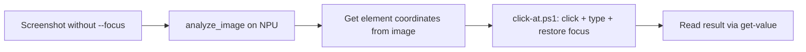

# Windows Computer Use — winappcli v0.4.0 (Microsoft UIA) + CDP Bridge

Three layers of Windows automation, in order of preference:

1. **CDP Bridge** (extension + Playwright + TCP command server) — full DOM control of Chrome. FIRST CHOICE for any browser-based task (form filling, search, clicking React widgets). Use `references/chrome.md` for Amazon Flights URL shortcut patterns and TCP command server reference.
2. **winappcli / UIA** — headless, mouse-free, for NATIVE Windows apps (Calculator, Notepad, dialogs) and READING browser text (get-value RootWebArea). Do NOT use UIA to interact with browser form widgets (React/SPA) — UIA sees only opaque Groups without interactive patterns.
3. **Screenshot + NPU vision** — for canvas/WebGL content UIA and CDP can't reach

## Architecture

```
WSL (Hermes)
  │  powershell.exe -Command "winapp ui <command> <selector> -a <app>"
  ▼
Windows → winapp.exe → UIA API → Target App
            ├── Mouse-free: invoke, set-value, focus, scroll
            ├── Mouse-capture: click, hover
            ├── Read: inspect, search, get-value, get-property
            └── Capture: screenshot, get-focused
  + WScript.Shell SendKeys (COM) for keyboard shortcuts (^c, ^v, ^a)
  + C# mouse_event (Add-Type) for drag operations
```

Session artifacts: `C:\Users\<user>\computer_use_tool\<session_id>\content\`

## Prerequisites

```powershell
winget install Microsoft.winappcli
winapp --version    # should show 0.4.0+
```

## Universal Options

Every `winapp ui` command accepts these:

| Option | Alias | Purpose |
|--------|-------|---------|
| `-a <app>` | `--app` | Target by process name, window title, or PID. If multiple windows match, lists them and auto-selects (foreground > largest). |
| `-w <HWND>` | `--window` | Target a specific window by HWND (from `list-windows`). **Always use this for multi-window scenarios** — takes precedence over `-a`. |
| `--json` | | Output as JSON for parsing in scripts. |
| `-q` | `--quiet` | Suppress progress/info messages. |
| `-v` | `--verbose` | Enable verbose output. |

## Command Reference (16 commands)

---

### `list-windows`
List all visible windows with HWND, title, size, and PID.

```powershell
winapp ui list-windows                              # all windows
winapp ui list-windows -a notepad                   # filter by app
winapp ui list-windows -a calculator --json          # JSON output for parsing
```

**Output**: `HWND <number>: "<title>" (window, WxH) [ClassName] (ProcessName, PID N)`

**Note**: Each line includes the HWND — copy it for `-w` targeting. The `[foreground]` tag marks the active window. Multi-tab apps (same PID) show once per tab.

---

### `status`
Connect to an app and display connection info.

```powershell
winapp ui status -a notepad                         # brief status
winapp ui status -a notepad --json                   # JSON with PID, title, UIA mode
winapp ui status -w 788608                          # by HWND
```

---

### `inspect`
View the UI element tree with semantic slugs, types, names, and bounding rectangles.

```powershell
winapp ui inspect -a notepad                        # interactive tree (compact)
winapp ui inspect -a notepad --depth 10              # deep tree — more levels
winapp ui inspect -w 395414 --depth 5               # by HWND, limited depth
```

**Slug format**: Elements get stable slugs like `doc-texteditor-4d8d`, `num4Button`, `equalButton`. Use these slugs as selectors in other commands.

**Element entry format**: `slug ElementType "Name" (x,y WxH) [state]`

---

### `search`
Search the element tree for elements matching a text query. Returns all matches with slugs.

```powershell
winapp ui search Document -a notepad                # find all Document elements
winapp ui search Text -a notepad | Select-String editor  # find edit area
winapp ui search Button -a calculator --max 10      # first 10 buttons
winapp ui search "Multiply" -a calculator --json     # JSON output
```

**`--max <N>`**: Limit results (default 50).

**Selector search order**: AutomationId → Name → ControlType → ClassName. Bare text searches all of these.

---

### `get-value`
Read the current value from an element. Tries TextPattern (RichEditBox, Document) → ValuePattern (TextBox, ComboBox, Slider) → Name fallback.

```powershell
winapp ui get-value doc-texteditor-4d8d -a notepad  # read document text
winapp ui get-value CalculatorResults -a calculator  # read calculator display
winapp ui get-value num5Button -a calculator          # get button name/state
winapp ui get-value <selector> -a <app> --json        # structured output
```

**Use case**: Reading text from editors, display values from calculators, slider positions, combobox selections.

---

### `set-value`
Set a value on an element using UIA ValuePattern. Works for TextBox, ComboBox, Slider, and Document controls.

```powershell
# Write text into editor
winapp ui set-value doc-texteditor-4d8d "Hello world" -a notepad

# Multi-line (use PowerShell backtick for newline)
winapp ui set-value doc-texteditor-4d8d "Line 1`nLine 2`nLine 3" -a notepad

# Set slider value
winapp ui set-value brightnessSlider "50" -a <app>
```

**Limitation**: Large text on Document controls may be truncated. Split into multiple calls or use SendKeys for very long content.

---

### `invoke`
Activate an element using UIA patterns. Tries InvokePattern → TogglePattern → SelectionItemPattern → ExpandCollapsePattern. **Mouse-free.**

```powershell
winapp ui invoke num4Button -a calculator            # press button
winapp ui invoke equalButton -a calculator            # press equals
winapp ui invoke multiplyButton -a calculator         # press multiply
winapp ui invoke Close -a notepad                     # close window
```

**Rule**: Use `invoke` for every button/checkbox/menu item. It's the mouse-free reliable path. Falls back to `click`-style mouse simulation only if no UIA pattern exists.

---

### `click`
Click an element by mouse simulation (SendInput). Use when `invoke` doesn't work (column headers, list items, custom controls).

```powershell
winapp ui click <selector> -a <app>                  # single click
winapp ui click <selector> -a <app> --double         # double-click
winapp ui click <selector> -a <app> --right          # right-click
```

**Warning**: Captures the mouse cursor. User can't use their mouse during this. Prefer `invoke` first.

---

### `hover`
Move the mouse to an element's center to trigger hover effects (tooltips, flyouts, visual states). Uses SendInput with a configurable dwell time.

```powershell
winapp ui hover <selector> -a <app>                  # hover over element
winapp ui hover saveButton -a notepad                # trigger save tooltip
```

**Warning**: Captures the mouse cursor briefly. For triggering tooltips only — otherwise avoid.

---

### `focus`
Move keyboard focus to an element using UIA SetFocus. **Mouse-free.**

```powershell
winapp ui focus doc-texteditor-4d8d -a notepad       # focus the editor
winapp ui focus searchBox -a <app>                   # focus a search field
```

**Use case**: Before typing or sending keyboard shortcuts, ensure the right element has focus.

---

### `get-focused`
Show the element that currently has keyboard focus in the target app. Returns slug, name, type, bounds.

```powershell
winapp ui get-focused -a notepad                     # what's currently focused?
winapp ui get-focused -a calculator --json            # structured focus info
```

**Use case**: Debugging keyboard navigation — verify which control will receive SendKeys.

---

### `scroll-into-view`
Scroll an element into the visible area using UIA ScrollItemPattern. **Mouse-free.**

```powershell
winapp ui scroll-into-view <selector> -a <app>      # scroll element into view
winapp ui scroll-into-view addButton -a notepad      # reveal a specific button
```

---

### `scroll`
Scroll a container element using ScrollPattern.

```powershell
winapp ui scroll <selector> -a <app> --direction down    # scroll down
winapp ui scroll <selector> -a <app> --direction up      # scroll up
winapp ui scroll <selector> -a <app> --to top            # jump to top
winapp ui scroll <selector> -a <app> --to bottom         # jump to bottom
```

**Note**: `--direction` and `--to` are mutually exclusive. Works on scrollable containers (lists, text areas, panels).

---

### `screenshot`
Capture a window or element as a PNG image.

```powershell
# By app (may composite multiple windows)
winapp ui screenshot -a notepad --output C:\path\ss.png

# By HWND (preferred — single window only)
winapp ui screenshot -w 263800 --output C:\path\ss.png

# Full screen with popups/overlays
winapp ui screenshot -a notepad --capture-screen --output C:\path\ss.png

# Focus the window first then capture
winapp ui screenshot -a notepad --focus --output C:\path\ss.png

# JSON output (returns file path + dimensions)
winapp ui screenshot -a notepad --json
```

**Flags**:
- `--capture-screen`: BitBlt from screen DC — includes popups, overlays, context menus the app doesn't own. Implies `--focus`.
- `--focus`: Bring window to foreground before capture.
- `--output <path>`: Save to file. Without it, just reports window dimensions.
- **Multiple windows**: When `-a` matches multiple windows (same PID, multiple tabs), winapp composites them into a single image. Use `-w HWND` to capture one specifically.

---

### `wait-for`
Wait for an element to appear, disappear, or reach a value. Polls at 100ms intervals.

```powershell
# Wait for element to appear (default)
winapp ui wait-for saveCompleteDialog -a notepad

# Wait for element to disappear
winapp ui wait-for progressBar -a <app> --gone

# Wait for a specific value
winapp ui wait-for CalculatorResults -a calculator --value "126"

# Wait with property and substring matching
winapp ui wait-for statusBar -a <app> --property Name --value "Ready" --contains

# Custom timeout (default 5000ms)
winapp ui wait-for loadingIndicator -a <app> --timeout 10000
```

**Flags**:
- `--gone`: Wait for element to disappear (instead of appear).
- `--value <text>`: Wait for element's value to equal this (TextPattern → ValuePattern → Name fallback).
- `--property <name>`: Check a specific property instead of the default value.
- `--contains`: Use substring matching with `--value`.
- `--timeout <ms>`: Max wait time (default 5000ms).

**Use case**: Synchronization — wait for a dialog to appear, a calculation to finish, a file to finish saving, or a progress bar to close.

---

### `get-property`
Read UIA property values from an element.

```powershell
# All properties
winapp ui get-property doc-texteditor-4d8d -a notepad

# Single property
winapp ui get-property doc-texteditor-4d8d -a notepad -p BoundingRectangle
winapp ui get-property doc-texteditor-4d8d -a notepad -p HasKeyboardFocus

# JSON output
winapp ui get-property <selector> -a <app> --json
```

**Useful properties**: `BoundingRectangle` (x,y,w,h), `IsEnabled`, `IsOffscreen`, `HasKeyboardFocus`, `IsReadOnly`, `ScrollHorizontalPercent`, `ScrollVerticalPercent`, `ClassName`, `AutomationId`.

---

## SendKeys Reference (.NET WScript.Shell)

Used for keyboard shortcuts that UIA doesn't cover (Ctrl+C, Ctrl+V, Ctrl+A, etc.).

```powershell
$obj = New-Object -ComObject WScript.Shell
$obj.SendKeys("^a")         # Ctrl+A (select all)
$obj.SendKeys("^c")         # Ctrl+C (copy)
$obj.SendKeys("^v")         # Ctrl+V (paste)
$obj.SendKeys("^x")         # Ctrl+X (cut)
$obj.SendKeys("^s")         # Ctrl+S (save)
$obj.SendKeys("^z")         # Ctrl+Z (undo)
$obj.SendKeys("^y")         # Ctrl+Y (redo)
$obj.SendKeys("^f")         # Ctrl+F (find)
$obj.SendKeys("^{HOME}")    # Ctrl+Home (go to start)
$obj.SendKeys("^{END}")     # Ctrl+End (go to end)
$obj.SendKeys("{ENTER}")    # Enter
$obj.SendKeys("{TAB}")      # Tab
$obj.SendKeys("{DELETE}")   # Delete
$obj.SendKeys("{BACKSPACE}")# Backspace
$obj.SendKeys("{ESC}")      # Escape
$obj.SendKeys("{F1}")       # F1 through {F12}
$obj.SendKeys("%{TAB}")     # Alt+Tab
% = Alt, ^ = Ctrl, + = Shift
```

**Special characters that MUST be escaped**: `{ } [ ] ( ) + ^ % ~ < >`
Wrap in braces: `{.}` `{(}` `{)}` `{+}` `{^}` `{%}` `{~}`

**Better alternative**: Use `winapp ui set-value` instead of SendKeys for typing text. It doesn't capture the keyboard.

## Mouse Drag (C# mouse_event)

Only needed when UIA can't select text programmatically. Captures mouse for ~600ms.

```powershell
Add-Type -AssemblyName System.Windows.Forms
Add-Type @"
using System; using System.Runtime.InteropServices;
public class MouseHelp {
    [DllImport("user32.dll")] public static extern void mouse_event(uint f, uint x, uint y, uint d, UIntPtr e);
    [DllImport("user32.dll")] public static extern bool SetCursorPos(int x, int y);
    public const uint MOVE=0x0001, DOWN=0x0002, UP=0x0004, ABS=0x8000;
}
"@
$sw = [System.Windows.Forms.Screen]::PrimaryScreen.Bounds.Width
$sh = [System.Windows.Forms.Screen]::PrimaryScreen.Bounds.Height
function AbsPos([int]$x) { [UInt32]($x * 65535 / $sw) }
function AbsPosY([int]$y) { [UInt32]($y * 65535 / $sh) }
[MouseHelp]::SetCursorPos($fromX, $fromY); Start-Sleep 100
[MouseHelp]::mouse_event([MouseHelp]::DOWN, 0, 0, 0, [UIntPtr]::Zero)
for ($i=1; $i -le 20; $i++) {
    [MouseHelp]::mouse_event([MouseHelp]::MOVE+[MouseHelp]::ABS, (AbsPos($fromX+($toX-$fromX)*$i/20)), (AbsPosY($fromY+($toY-$fromY)*$i/20)), 0, [UIntPtr]::Zero)
    Start-Sleep -Milliseconds 30
}
[MouseHelp]::mouse_event([MouseHelp]::UP, 0, 0, 0, [UIntPtr]::Zero)
```

## Launch Apps

Note: Windows 11 app process names may differ from Windows 10:

```powershell
Start-Process Notepad             # Windows 11: 'Notepad' (capital N) — NOT 'notepad'
Start-Process calc                # Windows 11: launches as CalculatorApp process
Start-Process chrome -ArgumentList 'https://example.com'   # Opens new tab in existing Chrome (headless!)
# msedge may not be on PATH — use chrome or full path:
# Start-Process 'C:\Program Files (x86)\Microsoft\Edge\Application\msedge.exe'
Start-Process cmd                 # Command Prompt
Start-Process "C:\Path\to\app.exe"
Start-Sleep 2                     # wait for window to appear
```

## Multi-Window Strategy

When an app has multiple windows/tabs (same PID), **always**:

1. `winapp ui list-windows -a <app>` — get all HWNDs
2. Pick the right HWND from the output
3. Pass `-w <HWND>` to every subsequent command

```powershell
# Wrong: targets ambiguous PID
winapp ui screenshot -a notepad --output C:\path\ss.png

# Right: unambiguous window
$hwn = winapp ui list-windows -a notepad | Select-String "Untitled"
winapp ui screenshot -w $hwn --output C:\path\ss.png
```

## Token Optimization: The 3-Layer Pipeline

Cost-optimized order of operations for ANY computer-use task:

```
Layer 1: URL/API shortcut (free, instant)
  Before scripting ANY UI interaction, check: does this site/app accept URL parameters?
  ✅ Google Flights: ?q=Flights+to+<to>+from+<from>+on+<date>
  ✅ Google Maps: /search/?q=<query>
  ✅ Amazon: /s?k=<search>
  ✅ YouTube: /results?search_query=<query>
  Saves: 10-15+ UI actions → 1 terminal() call

Layer 2: UIA tree extraction (free, ~0 tokens)
  Instead of screenshot+vision (heavy, slow), read text via UIA:
    - get-value RootWebArea -a chrome     # entire page text
    - search <pattern> -a chrome --json   # find specific elements
    - get-value <specific-slug>           # read one section
  Saves: image upload + vision processing time + API cost

Layer 3: NPU parsing (free, zero API cost)
  Raw UIA text → structured data via Gemma NPU:
    - extract_json  → parse into clean JSON
    - classify_text → categorize/classify
  Saves: DeepSeek reasoning tokens (~$0.01 per complex parse)
```

### Cost Comparison (flight search example)

| Approach | terminal calls | DeepSeek tokens | NPU calls | Cost |
|----------|---------------|-----------------|-----------|------|
| One-at-a-time UIA | 15+ | ~15K | 0 | ~$0.01 |
| Screenshot+Vision | 3-4 | ~0 | 1 image | slow (45s) |
| **UIA+NPU (optimized)** | **2-3** | **~0** | **1 text** | **~$0** |

### Every Day Task workflow pattern

```
1. terminal()  → Start-Process chrome -ArgumentList '<url>'   # open with URL params
2. terminal()  → winapp ui get-value RootWebArea -a chrome     # read all text (read-only)
3. extract_json/classify_text                                  # NPU parses it
```

For tasks where URL params don't work: use CDP bridge → TCP command server for browser DOM interaction. Do NOT fall back to UIA invoke/click on browser form widgets — use the Playwright MCP extension bridge instead (see `references/amazon-flights.md` for the exact workflow).

## Routing: Direct vs Gemma Planning

- **1–2 step tasks** (open app, type URL, click one button, take screenshot): execute directly. No planning overhead.
- **3+ steps, conditional logic, search-then-act, multi-app orchestration**: call `create_plan` on Gemma NPU first. Gemma decomposes the goal into steps at zero API cost; DeepSeek reviews + executes.

## Cost Optimization: Three-Tier Execution Model

Goal: Minimize DeepSeek API calls. Route work to the cheapest capable tier.

**Tier 1 — PowerShell scripts (zero cost, zero network)**
- Batch multiple winapp ui commands into a single `terminal("powershell ...")` call chained with `;`
- Calculator demo: 8 actions (clear + 7 + + + 3 + = + get-value) in 1 call instead of 8 separate terminal() calls
- Use for: all winapp ui commands, Start-Process, file ops, screenshot capture
- Rule: never split independent winapp ui actions into separate terminal() calls — chain them

**Tier 2 — Gemma NPU (zero API cost, runs locally)**
- Element selection: dump inspect tree → `extract_json` on NPU picks the right slug (no DeepSeek reading the tree)
- Page reading: screenshot → `analyze_image` on NPU extracts structured data (flights, prices, tables, search results)
- Classification: `classify_text` on page content to decide next action
- Use for: ANY decision that doesn't need DeepSeek-level reasoning

**Tier 3 — DeepSeek (API cost, use sparingly)**
- Goal decomposition: what URL to use, what actions to plan
- Error recovery: interpreting failures, deciding alternatives
- Result interpretation: which flight is best, summarizing findings, answering user questions
- Only when Tiers 1-2 can't handle it

### Batching Pattern

Instead of N terminal() calls, chain with `;`:

```powershell
# 1 terminal() call replaces 8
powershell.exe -Command "winapp ui invoke clearButton -w <HWND>; Start-Sleep 0.3; winapp ui invoke num7Button -w <HWND>; Start-Sleep 0.3; winapp ui invoke plusButton -w <HWND>; Start-Sleep 0.3; winapp ui invoke num3Button -w <HWND>; Start-Sleep 0.3; winapp ui invoke equalButton -w <HWND>; Start-Sleep 0.5; winapp ui get-value CalculatorResults -w <HWND>"
```

The output captures ALL action results. The terminal session persists between `;` separators so state carries forward.

### URL Shortcut Pattern

**Before scripting UI interactions** for a web app, check if URL parameters can replace form-filling entirely:

- Google Flights: `https://www.google.com/travel/flights?q=Flights+to+<TO>+from+<FROM>+on+<YYYY-MM-DD>+one+way` — see `references/google-flights.md` for full workflow
- Google Search: `https://google.com/search?q=<query>`
- YouTube search: `https://youtube.com/results?search_query=<query>`
- Maps directions: `https://google.com/maps/dir/<from>/<to>`
- Amazon Flights: `/flights/search/<FROMCODE>_<FROMCITY>_<COUNTRY>/<TOCODE>_<TOCITY>_<COUNTRY>/1/0/0/E/<YYYY-MM-DD>/?uc=YES` — see `references/amazon-flights.md`
- Amazon search: `https://amazon.in/s?k=<query>`

This replaces 5-15 UIA interaction steps with a single `Start-Process chrome -ArgumentList '<url>'` call. Always try this first for web automation tasks.

### Example: Flight Search (corrected workflow — CDP bridge first)

**CRITICAL: This is the corrected approach. Do NOT use Start-Process chrome before bridge.**
See `references/amazon-flights.md` and `references/google-flights.md` for full workflows.

```
Step 1: Kill Chrome        → powershell.exe "Get-Process chrome | Stop-Process -Force"
Step 2: Start bridge       → python3 cdp-bridge.py --port 9350 --token <TOKEN>
Step 3: Navigate via URL   → page.goto(search-URL, timeout=45000) via TCP command server
Step 4: Read results       → page.evaluate("document.body.innerText") via TCP command server
Step 5: Compare platforms  → page.goto(google-flights-URL), then read results
Step 6: Kill bridge        → pkill -f cdp-bridge.py
DeepSeek:                  Parse flight data from page text, present to user
Total: ~6 terminal calls + 0 DeepSeek tokens for data extraction
```

## Core Constraint: User-First Headless Operation

**This user dual-tasks during automation.** They want to keep using their machine while winappcli works in the background. Therefore:
- **ALWAYS prefer headless UIA commands** by default (see Headless vs Focus-Stealing table below)
- **NEVER use SendKeys or `--focus` unless the user explicitly says they want to see something**
- For opening URLs: use `Start-Process chrome -ArgumentList '<url>'` — zero focus theft
- For reading page content: use `get-value RootWebArea -a chrome`
- For clicking: use `invoke` — if the element doesn't support invoke, tell the user rather than silently falling back to `click`
- `screenshot` without `--focus` works in the background via PrintWindow

**Only escalate to focus-stealing commands when**: (a) the user asks to see something on their screen, or (b) the element genuinely has no UIA pattern and the user explicitly approves a `click` or SendKeys call.

## Headless vs Focus-Stealing Operations

**Key concern**: Focus-stealing operations prevent the user from working during automation. Prefer headless UIA commands.

| Operation | Headless ✅ | Focus-stealing ❌ | Notes |
|-----------|-------------|-------------------|-------|
| `invoke` | UIA InvokePattern/TogglePattern/SelectionItemPattern | — | Works on tabs, buttons with UIA patterns |
| `set-value` | UIA ValuePattern | — | For edit fields, address bar, text boxes |
| `get-value` | UIA TextPattern/ValuePattern | — | Reads text, page content |
| `inspect` / `search` / `get-property` | Read-only tree queries | — | |
| `scroll` / `scroll-into-view` | UIA ScrollPattern | — | |
| `focus` | UIA SetFocus (logical) | — | Doesn't bring window to foreground |
| `get-focused` | Read-only | — | |
| `wait-for` | Polling, read-only | — | |
| `list-windows` / `status` | Read-only | — | |
| `screenshot` (no flags) | PrintWindow API | — | Captures even minimized windows |
| `screenshot --focus` | — | ❌ Brings window to foreground | Use only when user wants to see it |
| `screenshot --capture-screen` | — | ❌ Implies --focus | Captures overlays/popups |
| `click` / `hover` | — | ❌ SendInput mouse capture | Prefer `invoke` |
| SendKeys (^t, ^c, ^v, {ENTER}) | — | ❌ WScript.Shell keyboard | Prefer UIA alternatives |
| Mouse drag | — | ❌ C# mouse_event | Prefer get-value + parse |

**Rule of thumb**: ~90% of tasks can be done headless via UIA. Reserve SendKeys for keyboard shortcuts and `click` only for elements that don't support UIA patterns.

## Workflow Patterns

### Open a URL in existing Chrome — HEADLESS (preferred)

Does NOT steal focus. Opens as a new tab in the existing window:

```powershell
Start-Process chrome -ArgumentList 'https://example.com'
```

Wait for load, verify by title:
```powershell
Start-Sleep 3
winapp ui list-windows -a chrome    # title updates to "Page Title - Google Chrome"
```

Screenshot without focus steal:
```powershell
winapp ui screenshot -a chrome --output C:\path\ss.png
```

**Why this works**: Chrome (already running) opens the URL in a new tab automatically. No UIA interaction, no SendKeys, no focus change.

### Open a URL in Chrome — with focus (user wants to see it)

Use only when the user explicitly asks to see something on screen:

```powershell
Start-Process chrome -ArgumentList 'https://example.com'
Start-Sleep 3
winapp ui screenshot -w <HWND> --focus --output C:\path\ss.png
```

### Open URL in MS Edge

Edge may not be on PATH (in Program Files). Find the actual process first:
```powershell
winapp ui list-windows | Select-String edge
Start-Process 'C:\Program Files (x86)\Microsoft\Edge\Application\msedge.exe' 'https://example.com'
```

### Chrome — full reference

See `references/chrome.md` for URL shortcut patterns, UIA selectors, extension CDP setup guide, V2 protocol internals (chrome.tabs.create, chrome.debugger.attach/detach/sendCommand), and React widget interaction strategy.

### Standard web-app inspect → interact
```powershell
# 1. Launch + wait
Start-Process notepad; Start-Sleep 2

# 2. Inspect to find element slug
winapp ui inspect -a notepad

# 3. Write text
winapp ui set-value doc-texteditor-xxxx "Hello" -a notepad

# 4. Read result
winapp ui get-value doc-texteditor-xxxx -a notepad

# 5. Screenshot
winapp ui screenshot -a notepad --output C:\path\ss.png
```

### Wait-then-act (synchronization)
```powershell
Start-Process myslowapp.exe
winapp ui wait-for mainWindow -a myslowapp --timeout 15000
winapp ui set-value searchBox "query" -a myslowapp
```

### Window → text extraction → clipboard (no mouse drag)
```powershell
# Instead of drag-selecting text, read it programmatically
$text = winapp ui get-value doc-texteditor -a notepad --json
# Parse $text in PowerShell to extract lines 2-3
$lines = $text.Split("`n")
$selected = $lines[1..2] -join "`n"
# Write to the other window
winapp ui set-value doc-texteditor-xxxx $selected -a notepad2
```

### JSON-driven automation
```powershell
$json = winapp ui inspect -a calculator --depth 10 --json
$buttons = $json | ConvertFrom-Json
$buttons.tree.elements | Where-Object { $_.name -match "num[0-9]" }
```

## The Mouse Takeover Problem

`click`, `hover`, and mouse `drag` capture the physical cursor. SendKeys captures the keyboard. This means the user can't use their machine during those operations.

### Solution: Use UIA pattern commands (mouse-free)

| Action | Mouse-free ✅ | Mouse-capturing ❌ |
|--------|--------------|-------------------|
| Press a button | `invoke` | `click` |
| Type text | `set-value` | SendKeys |
| Read text | `get-value` | — |
| Select text | `get-value` + parse in code | Mouse drag |
| Get element info | `inspect`, `search`, `get-property` | — |
| Scroll | `scroll`, `scroll-into-view` | — |
| Screenshot | `screenshot` (no `--focus`) | `screenshot --focus` / `--capture-screen` |
| Focus element | `focus` | — |
| List windows | `list-windows` | — |
| Wait for condition | `wait-for` | — |
| Keyboard shortcut | — | SendKeys (50ms, unavoidable) |

**90% of tasks need zero mouse capture.** For the remaining 10% (SendKeys shortcuts), each call is ~50ms — barely perceptible.

### Avoiding drag-select entirely

Instead of mouse-dragging to select lines 2-3:
1. `get-value doc-texteditor -a notepad` — read all text
2. `$text.Split("`n")[1..2]` — extract lines in PowerShell
3. `set-value doc-texteditor-xxxx "..." -a notepad2` — write to target

Faster, reliable, no mouse touch.

## Session & Artifact Management

```
C:\Users\<user>\computer_use_tool\
  └── <session_id>\                  # e.g., cu-20260719-42abc
      └── content\
          ├── screenshots\           # all PNG captures
          ├── logs\                  # action logs per session
          └── results\               # extracted values, tree dumps
```

Session IDs: `cu-<topic-or-date>-<short-hash>`

Cleanup:
```powershell
Remove-Item -Recurse -Force C:\Users\<user>\computer_use_tool\<session_id>
Remove-Item -Recurse -Force C:\Users\<user>\computer_use_tool\   # all sessions
```

## UIA Limitations & Fallbacks

### Why Browser Content Is Hard

Native Windows apps (Calculator, Notepad, file dialogs) expose every control through UIA — Buttons have InvokePattern, TextBoxes have ValuePattern. The OS enforces this.

Browsers are a single native window rendering HTML internally. The browser translates the DOM into UIA's accessibility tree, but this translation is:
- **Lossy**: Complex widgets (date pickers, custom dropdowns) appear as opaque "Group" with no children
- **Incomplete**: Shadow DOM, canvas, and third-party widgets often produce zero UIA nodes
- **No HTML mapping**: Can't ask "find input id='fromField'" — UIA doesn't know HTML ids or CSS classes

### Content Type → Right Tool

| Content type | Tool | Why it works |
|---|---|---|
| **Native Windows** (Calculator, Notepad, dialogs) | UIA / winappcli | Controls expose UIA patterns natively |
| **Browser DOM** (webpages, popups, forms) | CDP via Playwright | Talks directly to Chrome's internal DOM — no UIA translation loss |
### Canvas/WebGL (games, visual editors) | Screenshot + NPU vision | Only option — no DOM, no UIA, pixels only |

## WSL Mirrored Networking (critical for WSL→Windows access)

WSL2's default NAT mode blocks WSL from reaching Windows' `127.0.0.1`. Mirrored networking fixes this — WSL and Windows share the same LAN IP.

**Setup:**
```ini
# Add to %USERPROFILE%\.wslconfig on Windows:
[wsl2]
networkingMode=mirrored
```
Then `wsl --shutdown` and restart the terminal.

**Verify it's active:**
```bash
ip addr show eth2 | grep inet    # Should show a LAN IP like 192.168.29.x
ip route                         # Default gateway should be your router, not 172.x
```

**What it enables:**
- `curl http://localhost:<port>` from WSL reaches Windows services
- Chrome's `--remote-debugging-port` (on a separate profile) becomes reachable
- Any Windows-bound network service becomes accessible

**Known issues:**
- Old NAT interfaces (`eth0`, `eth1`) may still appear alongside the mirrored one (`eth2`) — ignore them, WSL uses the working route
- Some VPNs break mirrored networking — set `dnsTunneling=true` and `autoProxy=true` under `[wsl2]` if so
- Requires Windows 11 22H2+ or newer Windows Insider builds

### Browser DOM Access via Chrome DevTools Protocol (CDP)

Chrome 136+ silently ignores `--remote-debugging-port` on the default profile (tested Chrome 150). The flag shows in the command line but no port opens. Using `--user-data-dir=<separate>` gives a blank profile with no sessions.

**`chrome://inspect/#remote-debugging` toggle** (Chrome's built-in remote debugging):
- Enable the "Allow remote debugging" toggle on that page
- Chrome opens port 9222 on `127.0.0.1`
- Port accepts TCP but **rejects direct CDP** — 404 on `/json/version`, 403 on WebSocket upgrade
- Only works with official `chrome-devtools-mcp` server (`npx chrome-devtools-mcp@latest --autoConnect`)
- Requires Node.js on Windows, not usable from WSL directly

**Extension-based CDP V2** (Playwright MCP Bridge + `cdp-bridge.py` in WSL) — **the working path**:
- Uses `chrome.debugger` API — no flags, no restart, real profile with sessions
- **V2 protocol** (pass `&protocolVersion=2` in connect URL): supports `chrome.tabs.create`, `chrome.debugger.attach/detach/sendCommand` directly
- **Creates real tabs** via `Target.setAutoAttach` → `chrome.tabs.create("about:blank")` → attaches debugger
- Bridge runs in WSL, extension connects via `127.0.0.1` — Chrome blocks non-loopback WebSocket connections from extensions
- **Token is REQUIRED for unattended operation** — pass `--token <TOKEN>` to skip "Allow & select"
- Token: open connect page in Chrome → `inspect` → read `PLAYWRIGHT_MCP_EXTENSION_TOKEN=...` → save to `~/Work/creds/playwright-mcp-token.md`
- Bridge verified working end-to-end.

**V2 vs V1:**

| Capability | V1 (old) | V2 (current) |
|---|---|---|
| Create tabs | ❌ "not supported" | ✅ `chrome.tabs.create` |
| Survives same-origin slow nav | ❌ "Extension disconnected" | ✅ Connected |
| Proper detach | ❌ made-up "detach" cmd | ✅ `chrome.debugger.detach` |
| Reconnection | ❌ "Already attached" | ✅ Clean detach+reattach |
| New tab via JS | N/A | ⚠️ `window.open("url","_blank")` creates the Chrome tab but Playwright does NOT auto-attach the debugger — the tab is invisible to the TCP command server (`ctx.pages` count won't increase). Use `page.goto()` on `ctx.pages[0]` instead. |

**When to use CDP vs UIA vs Screenshot:**

| Situation | Tool |
|---|---|
| Reading page text | UIA `get-value RootWebArea` (fast, zero setup) |
| Clicking standard buttons/links | UIA `invoke` (fast, no browser connection needed) |
| Filling form fields on complex web UIs | CDP `page.fill()` or `page.evaluate()` |
| Interacting with popups/dropdowns UIA can't see | CDP `page.click()` + `page.wait_for_selector()` |
| Reading custom-rendered widgets | CDP `page.evaluate("document.querySelector(...).innerText")` |
| Canvas/WebGL/visual content | Screenshot + NPU `analyze_image` |

## CDP Bridge Correct Workflow: Kill Chrome → Bridge First → Navigate Managed Tab

**This is the CORRECT ordering, corrected by the user.** Do NOT open Chrome before the bridge.

### Step-by-step CDP workflow:

1. **KILL any Chrome processes** running outside the bridge:
   ```bash
   powershell.exe -Command "Get-Process chrome | Stop-Process -Force"
   ```
   This is critical — pre-existing Chrome windows create tabs in an unmanaged session
   outside the Playwright extension's tab group.

2. **START the bridge** (it opens Chrome automatically):
   ```bash
   TOKEN=$(grep -oP 'PLAYWRIGHT_MCP_EXTENSION_TOKEN=\\K.*' ~/Work/creds/playwright-mcp-token.md)
   python3 ~/.hermes/skills/windows-computer-use/scripts/cdp-bridge.py --port 9350 --token "$TOKEN"
   ```
   The bridge opens a Chrome window with the extension connect page in the Playwright-
   managed tab group. It then starts an internal Playwright session + TCP command server
   on `port+1` (port 9351).

3. **NAVIGATE the managed page** via TCP command server:
   The `page` variable in the TCP server is `ctx.pages[0]` — the connect page that the
   bridge created. Navigate it directly with `page.goto()`. Use 45s+ timeout for slow
   sites (Amazon, Google Flights).
   ```python
   import socket
   s = socket.socket(); s.settimeout(50)
   s.connect(('127.0.0.1', 9351))
   s.sendall(b'await page.goto("https://...", timeout=45000)\n')
   print(s.recv(16384).decode())
   s.close()
   ```

4. **INTERACT** via more TCP commands:
   ```python
   s = socket.socket(); s.settimeout(20)
   s.connect(('127.0.0.1', 9351))
   s.sendall(b'await page.evaluate("document.body.innerText")\n')
   print(s.recv(65536).decode())
   s.close()
   ```

5. **BRING TAB TO FOCUS** when the user wants to see it on screen:
   ```python
   import socket
   s = socket.socket(); s.settimeout(10)
   s.connect(('127.0.0.1', 9351))
   s.sendall(b'await page.bring_to_front()\n')
   print(s.recv(8192).decode())
   s.close()
   ```
   This activates the Playwright-managed tab in the Chrome window — the window title
   updates to reflect the managed page's URL. Use this when the user says "show me"
   or "bring it on focus."

6. **CLEAN UP**: Kill bridge when done: `pkill -f cdp-bridge.py`

### What NOT to do (all corrected by the user):

- ❌ `Start-Process chrome '<url>'` before starting the bridge — creates unmanaged tabs
- ❌ `window.open(url, '_blank')` from the connect page — opens a new Chrome tab but
     Playwright doesn't auto-attach the debugger. The tab is invisible to the TCP
     command server (`ctx.pages` count won't increase). Use `page.goto()` on the
     existing managed page (`ctx.pages[0]`) instead.
- ❌ UIA `invoke` on browser form widgets (React/SPA) — opaque Groups, no InvokePattern
- ❌ Short timeouts for slow sites — Amazon/Google Flights need 45s+
- ❌ Creating new Playwright pages (`ctx.new_page()`, `browser.new_page()`) — both
     are blocked by the extension. Navigate `page` (ctx.pages[0]) directly.

### Reference

```python
import asyncio
from playwright.async_api import async_playwright
async def main():
    async with async_playwright() as p:
        browser = await p.chromium.connect_over_cdp("ws://127.0.0.1:PORT")
        ctx = browser.contexts[0]
        # Find target tab by URL (opened before bridge started)
        target = None
        for pg in ctx.pages:
            if "target-site" in pg.url:
                target = pg
                break
        if not target:
            print("Target tab not found")
            return
        await target.goto("https://...")
        print(await target.title())
asyncio.run(main())
```

Key rules:
- Use `ctx.pages` to find an existing target tab (opened in Chrome before bridge started) — the connect page is `ctx.pages[0]`
- Never use `browser.new_page()` — fails with "Not allowed" (can't create isolated contexts)
- Never use `ctx.new_page()` — fails with "Tab creation is not supported yet" (extension limitation)
- One script = one connection = works every time. No "Another debugger already attached" errors.

### Custom Web UI Popups (UIA Blind Spots) + React Widget Strategy

Some web UIs use custom-rendered widgets that UIA cannot see:
- **Third-party booking widget popups** (Amazon flights "powered by" city selector, date pickers)
- **Custom dropdowns** with search fields that render as graphics, not form controls
- **Modal overlays** rendered outside the accessibility tree
- **React widgets** with obfuscated class names (CSS modules) — form fields appear as `<div>` with click handlers, not standard `<input>` elements

**Signs UIA can't reach an element:**
- `search` returns 0 matches for text visibly on screen
- `inspect --depth 19` shows text labels but no interactive elements nearby
- `get-value` shows stale data while the popup clearly shows different content
- The element appears in `screenshot` but not in any depth of the UIA tree

**Interaction strategy hierarchy (React widgets):**

0. **Read text, click text (golden rule)** — Before any CSS selector or ARIA role hunting, read the page text and click by visible label. Works on any framework: `page.get_by_text("One Way").first.click()`. CSS classes get obfuscated, ARIA roles get omitted, but displayed text is always accessible.

1. **URL parameters first** — check if the site has a URL-addressable search pattern (e.g. Amazon Flights: `/flights/search/FROM_TO/.../YYYY-MM-DD/`). Navigate directly via `page.goto()`.
2. **Playwright locators** — try `page.get_by_role()`, `page.get_by_text()`, standard CSS selectors. If none find the fields, proceed.
3. **Click-then-find** — React widgets often reveal input fields only AFTER clicking on a container div. Pattern: click on a labeled area (e.g. "From" text), then check `document.activeElement.outerHTML` — a hidden `<input placeholder="Select Airport">` may appear. Type via `page.keyboard.type()`, select dropdown with `page.get_by_text().click()`.
4. **Screenshot + NPU vision** — last resort. Capture screenshot, use `analyze_image` to identify coordinates, click at position. NPU-estimated coordinates may be off by 100+ pixels — calibrate against a known element's BoundingRectangle from UIA `get-property`.

**Key technique for Amazon Flights-style widgets:**
```python
# Click on the widget area to reveal inputs
await page.get_by_text("One Way").first.click()
# Now check what input appeared
input_html = await page.evaluate("document.activeElement.outerHTML")
# If it shows placeholder="Select Airport", type into it
await page.keyboard.type("Guwahati", delay=30)
await page.keyboard.press("Enter")
# Select the airport from dropdown
await page.get_by_text("Guwahati, India").first.click()
# Now the "To" field appears automatically
await page.get_by_text("Bengaluru").first.click()
# Date picker shows — click Search
await page.get_by_role("button", name="Search").click()
# URL now shows the search params: /flights/search/GAU_.../BLR_.../2026-07-31/
```

**UIA-only shortcut (no CDP needed)**: See `references/amazon-flights.md` for a pure-UIA approach — open `amazon.in/flights`, read the search form + results via `get-value RootWebArea`, and leverage the "Recent Searches" section's Group elements (which support InvokePattern) to trigger searches without Playwright.

### Fallback: Coordinate Clicking + SendKeys



**Script**: `scripts/click-at.ps1` (in this skill's directory)
```powershell
powershell.exe -ExecutionPolicy Bypass -File ~/.hermes/skills/windows-computer-use/scripts/click-at.ps1 -X <x> -Y <y> [-Type "text to type"]
```

The script:
1. Saves the current foreground window HWND
2. Moves mouse to (X, Y) and clicks (via C# mouse_event)
3. Optionally types text via SendKeys
4. Restores focus to the original window

**Important**: The coordinates must be absolute screen pixels. The screenshot tool captures at (window_left, window_top) to (window_left+width, window_top+height). The content position in the screenshot = content position in the window. Add the window's screen offset (from `inspect` output like `(-7,0 974x1087)`) to get absolute screen coordinates.

**Pitfall — NPU vision coordinates are NOT pixel-accurate.** When using `analyze_image` to find element coordinates, Gemma4 estimates visual positions but can be off by 100+ pixels. Verified example: the Search button was reported at image position (523, 534) but its actual UIA BoundingRectangle was (957, 358). Use UIA `get-property BoundingRectangle` on a known reference element to calibrate, or use `inspect` tree coordinates directly. Do NOT rely on NPU-estimated coordinates for precise clicking.

### SendKeys Focus Management

SendKeys sends keystrokes to the **currently keyboard-focused window**. This is the #1 source of failures:

```
WRONG (focus lost between commands):
  winapp ui invoke grp-xxx -w <HWND>       ← opens popup in Chrome
  powershell ... $wshell.SendKeys('text')   ← goes to TERMINAL, not Chrome!

RIGHT (chain in one PowerShell call):
  powershell.exe -Command "
    \$wshell.AppActivate('Chrome Title')    ← bring Chrome to front
    Start-Sleep 0.5
    \$wshell.SendKeys('text')               ← now goes to Chrome!
  "
```

**Rules**:
- Always use `$wshell.AppActivate(<windowTitle>)` before SendKeys
- Chain ALL AppActivate + winapp ui + SendKeys in a **single** `powershell.exe -Command "..."` call
- `$wshell` must be created in the same PowerShell session as the SendKeys call (use `New-Object -ComObject WScript.Shell` in the same command block)
- DON'T use separate `terminal()` calls for each step — batch them with `;`

### Slug Volatility

winappcli element slugs include a hash that changes on page reload:
```
grp-b6a0    ← before page reload
grp-99d7    ← after page reload (same element, new slug)
```

**Always re-run `inspect` or `search` after navigating to a new page.** Never hardcode slugs from a previous session's inspect output.

## Pitfalls

- **Do NOT use UIA invoke on browser form widgets**: Amazon Flights, Google Flights, and other React-based form widgets appear as opaque Group elements in the UIA tree — no InvokePattern, no ValuePattern, no way to interact. Using UIA invoke on these Groups either silently succeeds or fails. Instead use the CDP bridge for all browser DOM interaction.

- **Cross-origin navigation kills CDP session (V2)**: Navigating between different domains silently drops the CDP session.

- **Dialog/alert windows block CDP execution**: JS dialogs (alert, confirm, prompt, beforeunload) block Chrome's JS context. Page.evaluate/Page.goto fail with 'Connection closed while reading from the driver.' Signal: page title stays 'Loading <url>' forever. Prevention: suppress with page.on('dialog', lambda d: d.accept()) before navigating. Recovery: restart bridge+Chrome fresh.

- **PLAN FIRST, THEN EXECUTE**: Before running any multi-step automation, present the plan to the user. Get approval before executing.

- **ONE PLAYWRIGHT SESSION START TO FINISH**: The bridge's async detach doesn't reliably release the debugger. The next `connect_over_cdp()` call fails with `"Another debugger is already attached"`. Workaround: plan the entire interaction in one script — connect once, do everything, exit. To recover from "Already attached": kill bridge + Chrome together, restart both.

- **Use V2 protocol**: The bridge connects via `protocolVersion=2` which enables `chrome.tabs.create`, `chrome.debugger.attach/detach/sendCommand`. V1 (default) blocks tab creation and drops debugger on slow page loads. Verified: the extension source at `lib/background.mjs` defines `ProtocolV2Handler` with `ALLOWED_CHROME_COMMANDS = new Set(["chrome.debugger.attach", "chrome.debugger.detach", "chrome.debugger.sendCommand", "chrome.tabs.create", "chrome.tabs.remove"])`. Pass `&protocolVersion=2` in the connect URL to activate V2.
  
  **Working approach (USER'S CORRECTED FLOW)**: Start the bridge FIRST — the bridge opens Chrome with the extension connect page in a single managed Playwright session. Then navigate the managed page (`ctx.pages[0]`) directly to the target URL via the TCP command server. Do NOT use `Start-Process chrome` before the bridge — pre-opening Chrome creates unmanaged tabs outside the Playwright session. This was explicitly corrected by the user.

- **Slow pages (Amazon, Google Flights) need long timeouts**: Navigating `ctx.pages[0].goto(url)` on slow-loading sites like Amazon.in needs a 45s+ timeout. Use `timeout=45000` explicitly in the `page.goto()` call. With an adequate timeout, navigating the managed page (page 0) works reliably — this is the CORRECT approach per the user's established workflow. If the goto times out and the session drops, kill bridge + Chrome and restart fresh — the session is irrecoverable once disconnected.

- **Never pre-open Chrome before starting the bridge**: Do NOT use `Start-Process chrome -ArgumentList '<url>'` before starting the bridge. The bridge opens Chrome itself. Pre-opening Chrome creates tabs in an unmanaged window outside the Playwright extension's tab group — those tabs are invisible to the bridge's CDP session and cannot be controlled via Playwright. Always: kill all Chrome processes → start bridge (Chrome opens automatically) → navigate the managed page. This was explicitly corrected by the user.

- **Script canonical location**: All skill scripts live in `~/.hermes/skills/windows-computer-use/scripts/`. Run them directly from there — do NOT copy/sync to `~/.hermes/scripts/`. The copy at `~/.hermes/scripts/cdp-bridge.py` is a stale upstream version (no V2 protocol, no TCP command server, broken `webbrowser.open()` from WSL).

- **CDP bridge: extension relay must use 127.0.0.1**: Chrome extension WebSocket connections are restricted to loopback by default. Using the WSL LAN IP (e.g. `192.168.29.113`) in the relay URL causes a "only allowing loopback" error. Always use `127.0.0.1` — with WSL mirrored networking, Windows reaches WSL on localhost.

- **CDP bridge: websockets 16.x API**: The `process_request` callback receives `(connection, request)` where `request.path` is the URL path. The old API `(path, headers)` crashes with `AttributeError: 'ServerConnection' object has no attribute 'startswith'`. Fix the signature and return `websockets.http11.Response` objects for non-matching paths.

- **CDP bridge: WebSocket upgrades blocked by HTTP filter**: The CDP port's `process_request` must let WebSocket upgrade requests through (check `request.headers.get("upgrade", "").lower() == "websocket"`). Only return 404 for plain HTTP requests to unknown paths.

- **Playwright: use context pages, not browser.new_page()**: After `connect_over_cdp()`, `browser.new_page()` fails with `Target.createBrowserContext: Not allowed`. Use `browser.contexts[0].pages[0]` (existing tab) or `browser.contexts[0].new_page()` (new tab) instead. The extension's `chrome.debugger` API doesn't support creating isolated browser contexts.

- **Token auto-approval**: The extension token bypasses the "Allow & select" dialog. Store it at `~/Work/creds/playwright-mcp-token.md`. Extract it via UIA from the connect page (`chrome-extension://mmlmfjhmonkocbjadbfplnigmagldckm/connect.html?...`) — inspect the page, find the label containing `PLAYWRIGHT_MCP_EXTENSION_TOKEN=...`, and read its value.

- **UIPI**: Can't interact with elevated/admin windows from a non-elevated process. Run terminal elevated to target admin windows.
- **Locked workstation**: `click`, `hover`, SendKeys need an unlocked interactive desktop. UIA-pattern commands (`invoke`, `inspect`, `search`, `screenshot`, `set-value`, `get-value`, `focus`, `scroll`, `wait-for`) work headless.
- **Same-PID multi-window**: `-a <app>` targets by process name, so multiple tabs in the same PID can't be distinguished. Always use `-w <HWND>` from `list-windows` for per-window targeting.
- **Auto-selection ambiguity**: When `-a` matches multiple windows, winapp auto-selects (foreground > largest). Use `-w` to be explicit.
- **`set-value` truncation**: Large text on Document controls may be truncated. Split into multiple calls or use SendKeys for very long content.
- **SendKeys special chars**: `{}[]()+^%~<>` must be escaped: `{.}`, `{(}` etc. Prefer `set-value`.
- **PowerShell 5.1 vs 7**: Use `powershell.exe` (Windows PowerShell 5.1), not `pwsh.exe`, for WScript.Shell COM interop.
- **PowerShell 5.1 syntax gotchas**: No `||` operator (use `;` or `try/catch`). No `-IgnoreCase` on `Select-String` (it's case-insensitive by default). Prefer `;` chaining over `&&`/`||`. PowerShell ExecutionPolicy blocks `.ps1` scripts by default — use `-ExecutionPolicy Bypass -File script.ps1` or chain commands as `-Command` with `;` (preferred).
- **WSL variable escaping**: When running `powershell.exe -Command "..."` from WSL/bash, PowerShell's `$_` (pipeline variable) and `$var` must be escaped as `\$_` and `\$var` to prevent bash expansion. Example: `Where-Object { \$_.ProcessName -match 'chrome' }`
- **Add-Type assembly**: `System.Windows.Forms` must be loaded explicitly: `Add-Type -AssemblyName System.Windows.Forms`
- **Windows Terminal UIA limitations**: Terminal content area is DirectX-rendered with no UIA text pattern. Cannot read output or type commands via UIA. Tab switching works (via SelectionItemPattern), but for running commands use `powershell.exe -Command` from WSL instead.
- **winapp version drift**: This reference is for v0.4.0. Run `winapp --cli-schema` to get the authoritative current schema for any version.
- **WSL → Windows localhost**: Even with mirrored networking, services bound to Windows `127.0.0.1` may not be reachable from WSL over `localhost`. Services must bind to `0.0.0.0` or the LAN IP. Verify with `curl -v http://localhost:<port>` to distinguish "connection refused" (port not open) from "connection timed out" (port unreachable).
- **NPU-estimated coordinates are NOT pixel-accurate**: `analyze_image` returns approximate visual positions that can be off by 100+ pixels. Verified case: Search button was at UIA position (957, 358) but NPU estimated (523, 534). Use UIA `get-property BoundingRectangle` on a known reference element to calibrate, or use `inspect` tree coordinates directly. Never rely on NPU vision coords for precise clicking.

- **"Restore pages?" dialog blocks Chrome after bridge restart**: Killing Chrome
  via `Stop-Process -Force` triggers Chrome's crash-recovery dialog ("Chrome didn't
  shut down correctly. Restore pages?") on the next launch. This dialog is a separate
  HWND (owner of the main Chrome window) and blocks the browser until dismissed.
  To dismiss: find the dialog HWND via `winapp ui list-windows | Select-String 'Restore'`,
  then invoke the Close button: `winapp ui invoke btn-close-<hash> -w <dialog_HWND>`.
  The dialog's Close button has slug `btn-close-<hash>`. After dismissal, the main
  Chrome window becomes usable.

- **Do NOT pre-open Chrome before the bridge**: Already covered in the CDP Bridge workflow section above.

- **Slow sites (Amazon, Google Flights) need 45s+ timeout on `page.goto()`**: Amazon
  Flights and Google Flights can take 15-40 seconds to respond to `page.goto()`. The
  default timeout (30s) is insufficient. Always use `timeout=45000` explicitly.
  After a successful navigation, wait 4+ seconds before reading page content
  (`document.body.innerText`) — the page needs time to render search results
  asynchronously. Verified: `timeout=45000` with `wait_until="load"` works for the
  Amazon Flights search URL. — see `references/chrome.md` §4 for the full interaction strategy hierarchy (URL params → Playwright locators → click-then-find → screenshot+vision). Key technique: after clicking a React widget's "From" field, inspect `document.activeElement.outerHTML` — flight search inputs appear as `<input placeholder="Select Airport">` that weren't in the DOM before the click. Use `page.get_by_text()` to select dropdown suggestions.

- **Slow SPAs (YouTube Music) need `wait_until="commit"`**: Heavy single-page apps like music.youtube.com time out with `wait_until="domcontentloaded"` (default) when navigated via CDP. Use `wait_until="commit"` which only waits for the initial response headers, then let the SPA render asynchronously. Example: `await page.goto(url, wait_until="commit", timeout=25000)`.

- **JS dialogs kill the CDP execution context**: `alert()`, `confirm()`, `prompt()`, and `beforeunload` dialogs block Chrome's JavaScript context. `Page.evaluate` and `Page.goto` fail with "Connection closed while reading from the driver." The page title stays stuck on "Loading <url>...". **Prevention**: suppress dialogs before any navigation with `page.on("dialog", lambda d: d.accept())`. **Recovery**: restart bridge + Chrome fresh — the stuck state is irrecoverable.
